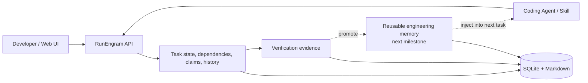

# RunEngram

**English** | [简体中文](./README.zh-CN.md)

[](https://github.com/MoonTseng/RunEngram/actions/workflows/ci.yml)
[](./LICENSE)

**Verified engineering memory for coding agents.**

Make every agent run improve the next.

RunEngram connects engineering work, agent execution, verification evidence,
and reusable project context in one loop. It does not replace Codex,
Claude Code, Cursor, or your existing engineering SOP. It gives those tools
one shared source of work truth and a path for turning verified experience into
context the next task can use.

> **Status: early alpha.** This repository currently ships the local task
> execution kernel. Verified exploration caching, learning promotion, and
> learning-lift metrics are the next product layer.

## Why RunEngram

AI coding makes one implementation faster. Real engineering still repeats
expensive work:

- every new session needs the same requirements and architecture explained;
- different agents search the same code paths and dependencies;
- useful lessons disappear into chat transcripts after a task finishes;
- boards show where work is, but do not make the next run more accurate;
- teams cannot tell how much exploration, rework, or manual effort AI removed.

RunEngram is not another project-management board. Its target loop is:

```text
work context -> agent run -> verified evidence -> learning -> next run
```

## What works today

- **Local-first:** one Go server and one SQLite file; no Redis or PostgreSQL.
- **One work truth:** web UI, REST API, CLI, and agent skill share the same
  task state.
- **Explicit workflow:** `pending → start → spec → dev → test → review → done`.
- **Structured context:** dependency DAG, priorities, labels, Markdown docs,
  images, and links.
- **Safe agent execution:** atomic claims, leases, heartbeats, and recovery.
- **Explainable history:** append-only task events record actor, time, and
  field-level changes.
- **Evidence gates:** GitHub PR, review-thread, and CI checks protect workflow
  completion.
- **Human visibility:** Kanban and dependency-graph views.
- **Bilingual UI:** English and Simplified Chinese.

The alpha binaries still use the names `taskline-server` and `taskline`. They
are RunEngram's task execution kernel. The public command names will be unified
before 1.0.

## Where RunEngram is going

The next milestone improves future work instead of adding more board features:

1. **Context Snapshot** freezes requirements, constraints, dependencies, and
   knowledge versions when work starts.
2. **Exploration Capsule** preserves verified code entry points, call paths,
   commands, negative paths, and freshness fingerprints.
3. **Evidence to Rule** promotes repeated lessons into project knowledge,
   skills, tests, or workflow gates.
4. **Learning Lift** measures search, explanation, rework, and manual steps
   saved by reused knowledge.
5. **Tool-agnostic Protocol** lets different coding agents and SOPs participate
   in the same learning loop.

Raw transcripts are not trusted knowledge. Promoted knowledge must retain
source, scope, verification evidence, code fingerprints, and invalidation
conditions.

## Quick start

Requirements:

- Go
- Node.js
- pnpm

Build everything:

```bash
git clone https://github.com/MoonTseng/RunEngram.git
cd RunEngram
./scripts/build.sh
```

Start the server:

```bash
cp .env.example .env
./dist/taskline-server
```

Open:

```text
http://127.0.0.1:8787/
```

In another terminal:

```bash
export TASKLINE_PROJECT=demo

./dist/taskline status
./dist/taskline register --name agent-a
./dist/taskline project create \
  --name demo \
  --description "RunEngram demo"
./dist/taskline task create \
  --title "Create first verified task" \
  --type feature \
  --priority 1
./dist/taskline task next --claim
```

`task next` previews work by default. An agent must use `--claim` before
starting execution.

## Use it in an existing project

Install the local CLI and public agent skill:

```bash
./scripts/install-local.sh
```

Enter the repository where the agent will work:

```bash
cd /path/to/your-project
export TASKLINE_SERVER=http://127.0.0.1:8787
export TASKLINE_PROJECT=your-project

taskline status
```

If `registered=false`, register the current working directory:

```bash
taskline register --name your-agent-name
taskline status
```

Codex or another compatible agent can now follow
[`skills/taskline-management/SKILL.md`](./skills/taskline-management/SKILL.md)
to claim, resume, update, and verify work.

## Architecture



More detail:

- [Architecture](./ARCHITECTURE.md)
- [Product philosophy](./PRODUCT.md)
- [L1 / L2 / L3 agent loop](./docs/agent-loop-architecture.zh-CN.md)
- [Contributor guide](./AGENTS.md)

## Development

```bash
( cd server && go test ./... )
( cd cli && go test ./... )
( cd web && pnpm lint && pnpm test && pnpm build )
./scripts/test-skill.sh
```

Release-style build:

```bash
./scripts/build.sh
```

## Stack

- **Server:** Go, Hertz, SQLite (`modernc.org/sqlite`, no CGO)
- **CLI:** Go, Cobra
- **Web:** React, Vite, Tailwind, TanStack Query, dnd-kit, React Flow

## Contributing

RunEngram is early. Reproducible bug reports, real engineering workflow
feedback, coding-agent adapters, and measurement designs are welcome.

Before submitting changes, run tests appropriate to the modified area. Never
commit task databases, tokens, private project documents, or local runtime
data.

## License

[MIT](./LICENSE)
