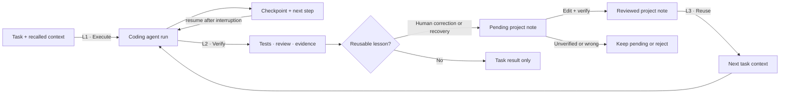
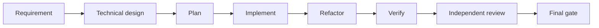
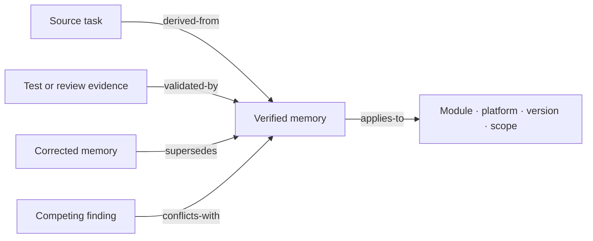
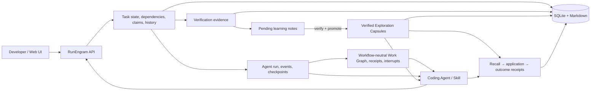

# RunEngram

[**English**](https://github.com/MoonTseng/RunEngram#readme) |
[简体中文](https://github.com/MoonTseng/RunEngram/blob/main/README.zh-CN.md#readme)

[](https://github.com/MoonTseng/RunEngram/actions/workflows/ci.yml)
[](./LICENSE)

**A local task runner and project memory for coding agents.**

RunEngram started from a problem we kept hitting in real projects: each new
Codex session needed the same requirements and architecture explained again.
Useful fixes stayed in old chats. The task board showed progress, but the next
agent still started from zero.

RunEngram keeps the task, the context given to the agent, the test evidence,
and any reusable lesson in one local store. Codex is the default client, but
the protocol also works with Claude Code or any tool that can call the CLI.

> **Early alpha.** We use it locally. Resumable Agent runs, workflow-neutral
> Work Graphs, context snapshots, stage receipts, human interrupts, learning
> review, layered recall, and observed reuse validation work now. Developers
> decide which reviewed candidates are project rules and which are scoped
> experience; RunEngram never turns a guess into a rule by itself.


<p align="center"><sub>The default Dracula view shows current stage, evidence, artifacts, pending decisions, and recalled project notes.</sub></p>

## What it is for

A task goes through five steps:

1. Write a task with enough context to execute.
2. An agent claims it and receives a fixed context snapshot.
3. A complex engineering change can use a durable Work Graph. Requirement analysis,
   design, implementation, verification, and review each leave a receipt.
4. Tests, review, and delivery evidence are attached to the task.
5. Reusable conventions, human corrections, and verified recovery paths become
   editable candidates. Only reviewed candidates reach later tasks.

| Problem we saw | What RunEngram does |
| --- | --- |
| Requirements and architecture get retyped in every session | Saves the task input and recalled notes in a fixed snapshot |
| A long Agent run is interrupted or moved to another session | Restores its latest checkpoint, next step, and recent run events |
| A multi-stage task looks busy but nobody knows what is complete | Shows the current stage, dependencies, artifacts, evidence, and pending human decision |
| Agents search the same files and repeat failed commands | Stores findings with project scope and code fingerprints |
| Corrections disappear in chat history | Records them as reviewable learning candidates |
| Nobody knows what the system learned | Shows a learning receipt on the active task and editable pending candidates |
| Old or guessed advice leaks into later work | Requires evidence before a candidate enters project memory |
| A note is correct but its provenance, scope, or replacement is unclear | Links memory through typed provenance, applicability, validation, conflict, and supersession edges |
| A team cannot tell whether saved context helped | Records useful, rejected, and stale reuse outcomes |


<details>
<summary>Paper theme</summary>


</details>

## How a task moves through RunEngram



RunEngram sits outside the coding agent. Existing prompts, skills, CI, and
team SOPs stay in place.

## Bring your own flow

RunEngram does not ship another workflow engine. It adds durable state around
the SOP a project already uses. The built-in `engineering-flow` provides a
useful eight-stage graph:



Codex, Claude Code, Pi, or another Agent still decides how to work inside each
stage. Project skills, commands, and human playbooks keep their domain rules.
RunEngram records only what must survive a session: dependencies, results,
artifact IDs, input versions, verification evidence, and explicit questions.

Other flows use the same protocol. A small JSON Workflow Adapter declares a
template name, version, nodes, capabilities, node kinds, and dependencies:

```bash
runengram run start <task-id> --agent-tool claude-code \
  --workflow content-review \
  --workflow-file examples/workflows/content-review.json
```

RunEngram validates the DAG, then stores its runtime state. It never executes
or reimplements the underlying SOP. See
[Workflow Adapters](./docs/design/2026-07-29-workflow-adapters.md).

Work Graphs are adaptive, not mandatory. Use one when work spans sessions, has
independent branches, expensive intermediate results, or a human gate. Small
fixes and short tasks stay on one Agent loop.

This makes progress inspectable without pretending that a Kanban column proves
work is correct. The Action Console reports observed counts—completed stages,
verified stages, attached artifacts, recalled memory, and open decisions. It
does not invent time-saved estimates.

## How it compares

The comparison uses each project's documented main purpose. It is not a
feature-by-feature scorecard.

| Capability | RunEngram | GitHub Copilot Memory | Claude Code memory | OpenHands | LinearB |
| --- | --- | --- | --- | --- | --- |
| Main job | Close task → evidence → memory loop | Store repository facts for Copilot | Persist instructions and auto memory | Execute agents in workspaces | Measure software delivery |
| Task state and agent leases | Yes | No | No | Execution sessions | Delivery workflow data |
| Durable multi-stage work graph | Built-in or custom flow + receipts + human interrupts | No | No | Agent workflow | Delivery workflow only |
| Resumable run checkpoints | Yes, tool-neutral protocol | No | Session transcript | Session state | No |
| Immutable task context | Yes | No | No | Workspace/session context | No |
| Evidence-gated memory promotion | Yes | Citation validation | Manual files / auto memory | No | No |
| Typed memory provenance and replacement | Yes: source, scope, evidence, conflicts, supersession | Citations | No | No | No |
| Explainable per-run recall | Reason codes, score, warnings, context revision | Citations | No | No | No |
| Observed memory reuse | Helpful / rejected / stale | No | No | No | No |
| Default deployment | Local single binary + SQLite | GitHub service | Local files | Local or remote runtime | SaaS |

Sources: [GitHub Copilot Memory](https://docs.github.com/en/copilot/concepts/agents/copilot-memory),
[Claude Code memory](https://docs.anthropic.com/en/docs/claude-code/memory),
[OpenHands](https://docs.openhands.dev/overview), and
[LinearB](https://linearb.io/platform/engineering-metrics).

## Implemented

- One Go server, one SQLite file, and local attachment storage.
- Web UI, REST API, CLI, and Agent Skill use the same task records.
- Task states: `pending → start → spec → dev → test → review → done`.
- Dependencies, priorities, labels, Markdown documents, images, and links.
- Atomic claims, leases, heartbeats, and interrupted-task recovery.
- First-class Agent runs for Codex, Claude Code, Pi, or another executor:
  normalized events, compact checkpoints, resume context, and completion status.
- Optional built-in `engineering-flow` plus custom JSON Workflow Adapters,
  dependency-checked stages, per-stage artifacts/evidence, typed human
  interrupts, and full resume state.
- Append-only task history with actor, time, and changed fields.
- Manual review and completion for teams without GitHub PR or CI; links and
  verification documents can still be attached when available.
- Action Console, Kanban, dependency graph, and engineering-memory views.
- English and Simplified Chinese UI; Dracula is the default theme.
- A fixed context snapshot when an agent starts a task.
- Reviewed memory has two layers: project rules with a dedicated per-task
  budget and relevance-loaded scoped experience.
- Recall uses a context budget rather than a fixed five-item limit. Agents can
  query memory again when implementation reveals a new module, error, or tool.
- Project findings with source task, scope, evidence, code fingerprints, and
  producer (`codex`, `claude-code`, or another tool).
- Learning candidates for human corrections and successful recovery paths.
- Durable human-provided project conventions can also become candidates.
- Pending candidates can be corrected before promotion; promoted memory is not
  silently rewritten. Material corrections supersede the old entry and retain
  both versions.
- Typed memory relations preserve `derived-from`, `validated-by`, `applies-to`,
  `supersedes`, `conflicts-with`, and `caused-by` links without adding a graph
  database.
- Every recall returns a compact context revision plus structured reasons,
  scores, and conflict warnings, so an Agent can say why a note entered its
  context.
- Every returned project rule and scoped experience creates a durable impact
  receipt. The receipt separates recall, actual application, and verified
  outcome instead of treating “included in context” as “helped”.
- Promoted-memory edits use optimistic concurrency. A stale browser tab cannot
  overwrite a newer correction.
- Manual promotion with evidence; rejected candidates stay out of recall.
- A visible recall → application → confirmation funnel, per-task decisions,
  verification evidence, and per-memory impact history.
- Counts for runs, completion, blocked recovery, candidates, promotions,
  recall coverage, application rate, confirmation rate, and actual results.

Canonical binaries are `runengram-server` and `runengram`. Release archives
also include `taskline-server` and `taskline` compatibility symlinks so
existing automation can migrate without downtime.

## How project notes are saved

1. When work starts, RunEngram saves the task input and recalled notes as a
   snapshot and opens or resumes an Agent run.
2. The Agent saves checkpoints at stage changes, blockers, and interruption.
3. A durable project convention, human correction, or successful recovery can
   create a pending learning candidate.
4. A developer can edit its trigger, guidance, and scope.
5. The candidate needs concrete evidence and a memory class before promotion:
   a project rule applies broadly; scoped experience is retrieved by relevance.
6. Every later recall first records what entered the Agent context and why.
7. The Agent or developer records whether it affected execution or was
   intentionally ignored.
8. Verification records whether applied memory helped, was rejected, or became
   stale, with a command, document, event, link, code reference, or observation
   as evidence. Feedback from distinct tasks changes confidence and validation
   state.

RunEngram does not copy whole chat transcripts. It does not store secrets,
tokens, hidden reasoning, or unreviewed guesses. Only reviewed entries are
recalled by later tasks.

### What is recorded automatically

| Signal | Result |
| --- | --- |
| Explicit reusable convention, such as `7.23.0_feat/<name>` | Pending learning candidate |
| Human correction that changes the execution route | Pending learning candidate |
| Failed route replaced by a verified reusable route | Pending learning candidate |
| Routine file read, successful command, temporary path, task-only wording | Run event or checkpoint only |
| Existing recalled rule used again | Reuse outcome; no duplicate memory |
| Secret, credential, raw transcript, hidden reasoning, guess | Never stored as memory |

The active-task screen shows a **Learning receipt**. Project Knowledge shows
pending candidates, their source task, and an edit action. Pending candidates
never affect another run.

### How reuse becomes visible

Recall is not counted as success. RunEngram keeps one impact receipt for each
task and recalled memory item:

| Receipt | Meaning |
| --- | --- |
| Recalled | Entered immutable task context or a later dynamic recall |
| Applied | Changed a decision, command, file set, or implementation route |
| Ignored | Agent inspected it and recorded why it did not apply |
| Helpful | Verification evidence confirmed the guidance |
| Rejected | Current task evidence contradicted the guidance |
| Stale | Current code or policy invalidated previously valid guidance |
| Unconfirmed | Task ended before an applied/ignored/final decision was recorded |

The task panel shows the matched rule, recall reason, stage, actor, notes, and
evidence. **Engineering Memory** shows both a project-wide funnel and each
memory item's task history. This makes outcomes such as “the Agent avoided the
forbidden full Gradle build” reviewable instead of hiding them in chat.

Metrics use stored receipts only:

- **Recall coverage** — completed Agent tasks with recalled memory ÷ completed
  Agent tasks;
- **Application rate** — tasks that applied at least one item ÷ tasks that
  recalled memory;
- **Confirmation rate** — tasks with a helpful/rejected/stale result ÷ tasks
  that applied or finalized memory.

Old context snapshots can be backfilled as `recalled`, but RunEngram never
guesses historical application or benefit. It does not claim time saved.

### How memory earns trust

| State | Meaning | Effect |
| --- | --- | --- |
| Pending candidate | Useful-looking conclusion without review | Never recalled |
| Verified | Developer supplied concrete evidence and enabled it | Available to later tasks |
| Trusted | Helpful in at least two task-level reuse observations | Ranked above equally relevant unproven experience |
| Disputed | Rejected more often than it helped, with at least two negative observations | Kept visible for correction, excluded from recall |
| Stale | Current code or tooling disproved it | Excluded from recall |

One task can update one outcome per memory item, so repeatedly clicking
“helpful” in the same task cannot manufacture trust. Never mark an item helpful
merely because it appeared in context. Review starts at 0.60,
helpful reuse adds 0.10, rejection subtracts 0.15, and stale memory drops to
zero. This is confidence in observed reuse, not a claim that RunEngram measured
hours saved.

When reviewing a pending candidate in **Engineering Memory**, choose what you
checked: a command or test, code or configuration, a reviewed document, a
reproduced fix, or an existing project convention. Then record two facts:

1. **Checked** — the command, file path, document, observed failure, or
   convention you inspected.
2. **Result** — what passed, what the code contains, what changed after the
   fix, or where the convention is already used.

Source-task documents, links, and recent events appear as shortcuts. Selecting
one fills the checked item; you still supply the observed result. RunEngram
keeps **Verify and use in later tasks** disabled until the evidence is
reviewable. This prevents “looks correct” from becoming project memory.

### How memory stays connected

RunEngram stores memory as small reviewed records plus typed edges:



This is a local SQLite adjacency model, not a new graph service. `supersedes`
marks the old entry stale, while conflicts remain visible as warnings. Recall
combines broad project rules, relevant scoped experience, explicit
`applies-to` edges, confidence, and observed reuse. Returned explanations let
the Agent distinguish “project rule” from “matched this module” instead of
blindly accepting an opaque top-k result.

Edits include the last observed update timestamp. If another reviewer changed
the same memory first, RunEngram returns a conflict and asks the browser to
reload instead of losing either correction.

Agents use the same guard through the CLI:

```bash
runengram capsule edit <capsule-id> \
  --expected-updated-at <updated-at-ms> \
  --summary "<corrected guidance>"
```

## Install as a Codex plugin

The repository contains a Codex marketplace plugin. It appears in Codex
**Plugins → Marketplace**:

```bash
codex plugin marketplace add MoonTseng/RunEngram --ref main
codex plugin add runengram@runengram
```

Both commands are required: the first adds the catalog; the second installs
the plugin. `plugin-creator` is not part of user setup. Confirm
`runengram@runengram` says `installed, enabled`:

```bash
codex plugin list
```

Fully restart Codex, start a new task, then ask:

```text
Set up RunEngram on this computer.
```

Setup downloads a checksum-verified release, installs it under `~/.local`,
pins the runtime to the installed plugin's base version, starts a loopback-only
service, and keeps project data local. After setup,
type `taskline-management <request>` or select **Taskline Management** from the
Skill picker. It is a Skill trigger, not a shell command. On first use inside
a Git repository, RunEngram derives the repository name and creates the
matching project automatically. When execution first needs a claim, it also
registers a workspace-scoped Codex identity automatically. To update:

```bash
codex plugin marketplace upgrade runengram
codex plugin add runengram@runengram
```

Fully restart Codex and start a new task after upgrade so refreshed skills load.

## Build from source

Requirements:

- Go
- Node.js
- pnpm

Build everything:

```bash
git clone https://github.com/MoonTseng/RunEngram.git
cd RunEngram
./scripts/build.sh
```

Start the server:

```bash
cp .env.example .env
./dist/runengram-server
```

Open:

```text
http://127.0.0.1:8787/
```

In another terminal:

```bash
export TASKLINE_PROJECT=demo

./dist/runengram status
./dist/runengram register --name agent-a
./dist/runengram project create \
  --name demo \
  --description "RunEngram demo"
./dist/runengram task create \
  --title "Create first verified task" \
  --type feature \
  --priority 1
./dist/runengram task next --claim
TASK_ID="<claimed-task-id>"
./dist/runengram task context "$TASK_ID"
./dist/runengram run start "$TASK_ID" --agent-tool codex \
  --workflow engineering-flow
RUN_ID="<run-id from previous output>"
./dist/runengram run node "$RUN_ID" requirement-analysis \
  --status completed \
  --summary "Scope and acceptance criteria confirmed" \
  --evidence "Requirement contract reviewed"
./dist/runengram run graph "$RUN_ID"
```

`task next` previews work by default. An agent must use `--claim` before
starting execution.

## Use it in an existing project

Install the local CLI and public agent skill:

```bash
./scripts/install-local.sh
```

Enter the repository where the agent will work:

```bash
cd /path/to/your-project
export TASKLINE_SERVER=http://127.0.0.1:8787
export TASKLINE_PROJECT=your-project

runengram status
```

If `registered=false`, register the current working directory:

```bash
runengram register --name your-agent-name
runengram status
```

Codex (default), Claude Code, or another CLI-capable agent can now follow
[`skills/taskline-management/SKILL.md`](./skills/taskline-management/SKILL.md)
to claim, resume, update, verify, and reuse engineering memory. The installer
links the same public skill into both `~/.agents/skills/` and
`~/.claude/skills/`.

### Prompt shorthand

Use the skill name as a prompt prefix. Brackets are optional.

```text
taskline-management <requirement>
taskline-management run <requirement>
taskline-management spec <requirement>
taskline-management pending <requirement>
```

- default: create one runnable task, then stop;
- `run`: create, claim, and execute that exact task; complex work can wrap an
  installed project flow in a durable Work Graph, while small work stays on a
  single loop;
- `spec`: create, claim, attach a Spec, then stop before code changes;
- `pending`: create the task in the non-runnable backlog.

Chinese aliases `执行`, `方案`, and `待规划` work too. Add
`project:CamScanner` when more than one RunEngram project exists. With one
project, the skill selects it automatically.

```bash
runengram task context <task-id>
runengram learning capture --project your-project --task <task-id> \
  --kind human-correction \
  --trigger "Notion requirement could not be read directly" \
  --guidance "Use the project's requirement-import step before PRD analysis" \
  --scope "Requirements linked from Notion" --producer codex
runengram learning list --project your-project --status pending
runengram learning edit <learning-note-id> \
  --trigger "Creating a feature branch for release 7.23.0" \
  --guidance "Use 7.23.0_feat/<english-requirement-name>" \
  --scope "Feature branches"
runengram learning promote <learning-note-id> \
  --memory-class project-rule \
  --evidence-file ./verified-learning.md
runengram learning reject <learning-note-id> \
  --reason "One-off environment issue; not reusable"
runengram capsule list --project your-project --query webview
runengram task recall <task-id> --query "Gradle daemon failed in three modules"
runengram capsule create --project your-project --source-task <task-id> \
  --memory-class experience --trigger "Deleting a compatibility service" \
  --title "Reusable boundary" --summary "Verified finding" \
  --scope "Affected module" --evidence-file ./evidence.md \
  --fingerprint module-name --producer codex
runengram capsule use <capsule-id> --task <task-id> --outcome used \
  --stage dev --notes "Changed verification route"
runengram capsule use <capsule-id> --task <task-id> --outcome helpful \
  --stage test --notes "Focused checks passed" \
  --evidence-kind command --evidence-ref "./gradlew :module:test" \
  --evidence-summary "exit 0"
runengram capsule metrics --project your-project
runengram task resume <task-id>
runengram project delete temporary-smoke-project
```

## Architecture



More detail:

- [Architecture](./ARCHITECTURE.md)
- [Product philosophy](./PRODUCT.md)
- [Workflow Adapter and Work Graph design](./docs/design/2026-07-29-workflow-adapters.md)
- [Graph Engineering research (Chinese)](./docs/research/graph-engineering-2026.md)
- [L1 / L2 / L3 agent loop](./docs/agent-loop-architecture.zh-CN.md)
- [Contributor guide](./AGENTS.md)

## Development

```bash
( cd server && go test ./... )
( cd cli && go test ./... )
( cd web && pnpm lint && pnpm test && pnpm build )
./scripts/test-skill.sh
./scripts/test-plugin-installer.sh
```

Release-style build:

```bash
./scripts/build.sh
```

## Stack

- **Server:** Go, Hertz, SQLite (`modernc.org/sqlite`, no CGO)
- **CLI:** Go, Cobra
- **Web:** React, Vite, Tailwind, TanStack Query, dnd-kit, React Flow

## Contributing

RunEngram is early. Reproducible bug reports, real engineering workflow
feedback, coding-agent adapters, and measurement designs are welcome.

Before submitting changes, run tests appropriate to the modified area. Never
commit task databases, tokens, private project documents, or local runtime
data.

## Privacy and data

RunEngram binds to `127.0.0.1` by default. Tasks, Markdown, attachments,
context snapshots, and engineering memory stay in the local RunEngram data
directory. Skills must never capture API tokens, credentials, raw private
chats, or hidden model reasoning.

## License

[MIT](./LICENSE)
