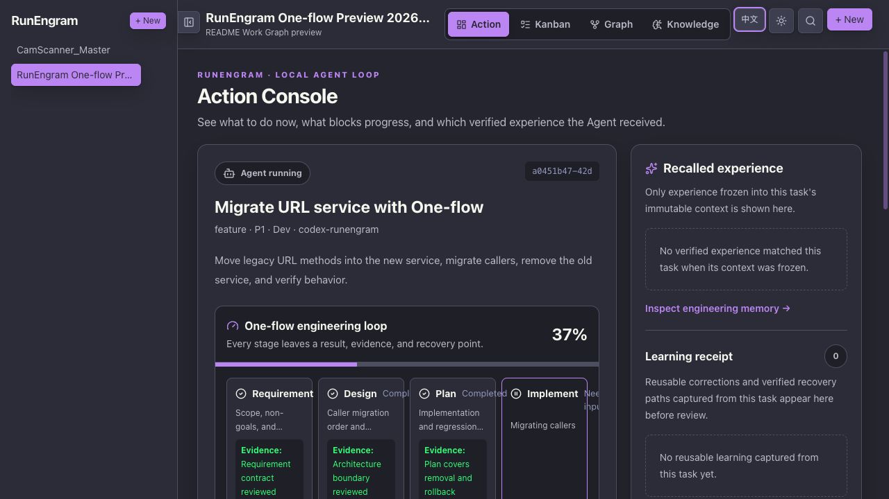
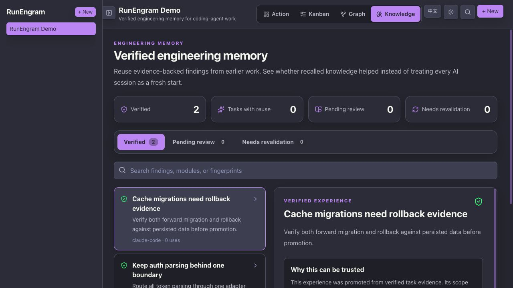
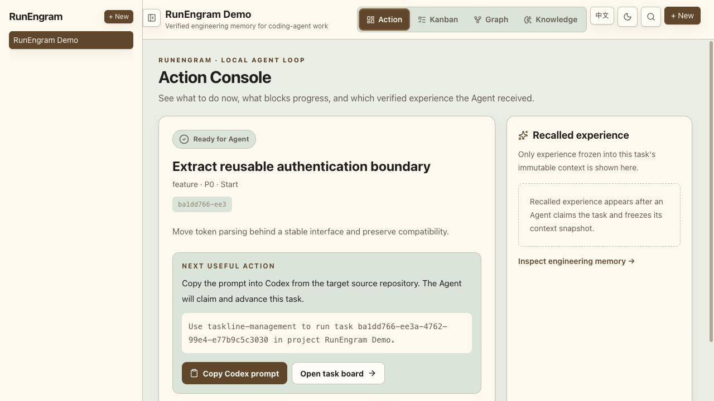
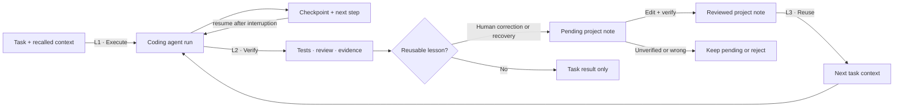
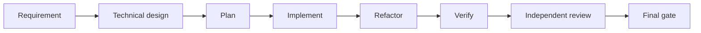
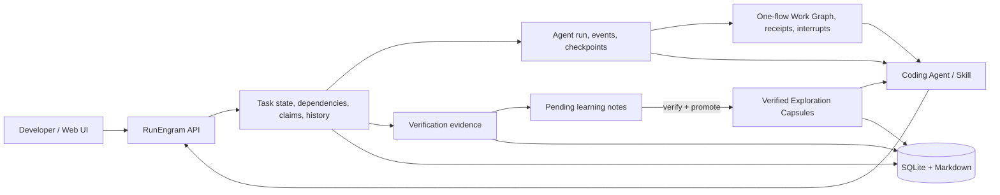

# RunEngram

[**English**](https://github.com/MoonTseng/RunEngram#readme) |
[简体中文](https://github.com/MoonTseng/RunEngram/blob/main/README.zh-CN.md#readme)

[](https://github.com/MoonTseng/RunEngram/actions/workflows/ci.yml)
[](./LICENSE)

**A local task runner and project memory for coding agents.**

RunEngram started from a problem we kept hitting in real projects: each new
Codex session needed the same requirements and architecture explained again.
Useful fixes stayed in old chats. The task board showed progress, but the next
agent still started from zero.

RunEngram keeps the task, the context given to the agent, the test evidence,
and any reusable lesson in one local store. Codex is the default client, but
the protocol also works with Claude Code or any tool that can call the CLI.

> **Early alpha.** We use it locally. Resumable Agent runs, One-flow Work
> Graphs, context snapshots, stage receipts, human interrupts, learning
> review, recall, and reuse metrics work now. Automatic conversion of
> experience into enforced project rules is not implemented.



<p align="center"><sub>The default Dracula view shows current stage, evidence, artifacts, pending decisions, and recalled project notes.</sub></p>

## What it is for

A task goes through five steps:

1. Write a task with enough context to execute.
2. An agent claims it and receives a fixed context snapshot.
3. A complex engineering change can use a durable Work Graph. Requirement analysis,
   design, implementation, verification, and review each leave a receipt.
4. Tests, review, and delivery evidence are attached to the task.
5. Reusable conventions, human corrections, and verified recovery paths become
   editable candidates. Only reviewed candidates reach later tasks.

| Problem we saw | What RunEngram does |
| --- | --- |
| Requirements and architecture get retyped in every session | Saves the task input and recalled notes in a fixed snapshot |
| A long Agent run is interrupted or moved to another session | Restores its latest checkpoint, next step, and recent run events |
| A multi-stage task looks busy but nobody knows what is complete | Shows the current stage, dependencies, artifacts, evidence, and pending human decision |
| Agents search the same files and repeat failed commands | Stores findings with project scope and code fingerprints |
| Corrections disappear in chat history | Records them as reviewable learning candidates |
| Nobody knows what the system learned | Shows a learning receipt on the active task and editable pending candidates |
| Old or guessed advice leaks into later work | Requires evidence before a candidate enters project memory |
| A team cannot tell whether saved context helped | Records useful, rejected, and stale reuse outcomes |



<details>
<summary>Paper theme</summary>



</details>

## How a task moves through RunEngram



RunEngram sits outside the coding agent. Existing prompts, skills, CI, and
team SOPs stay in place.

## One-flow without a second workflow engine

For requirement development, `cs-one-flow` wraps the existing SOP in eight
durable stages:



Codex or Claude Code still decides how to work inside a stage. Existing
`cs-sop-one-flow` skills still own project-specific development rules.
RunEngram only records what must survive a session: dependency state, result,
artifact IDs, input version, verification evidence, and explicit questions for
the developer.

The graph is adaptive, not the default for every task. An explicit one-flow
request enables it. Otherwise RunEngram selects it only when implementation has multiple
signals such as cross-session context loss, independent branches, expensive
intermediate results, or a human delivery gate. Small fixes, docs, and research
stay on a single Agent loop.

This makes progress inspectable without pretending that a Kanban column proves
work is correct. The Action Console reports observed counts—completed stages,
verified stages, attached artifacts, recalled memory, and open decisions. It
does not invent time-saved estimates.

## How it compares

The comparison uses each project's documented main purpose. It is not a
feature-by-feature scorecard.

| Capability | RunEngram | GitHub Copilot Memory | Claude Code memory | OpenHands | LinearB |
| --- | --- | --- | --- | --- | --- |
| Main job | Close task → evidence → memory loop | Store repository facts for Copilot | Persist instructions and auto memory | Execute agents in workspaces | Measure software delivery |
| Task state and agent leases | Yes | No | No | Execution sessions | Delivery workflow data |
| Durable multi-stage work graph | One-flow stages + receipts + human interrupts | No | No | Agent workflow | Delivery workflow only |
| Resumable run checkpoints | Yes, tool-neutral protocol | No | Session transcript | Session state | No |
| Immutable task context | Yes | No | No | Workspace/session context | No |
| Evidence-gated memory promotion | Yes | Citation validation | Manual files / auto memory | No | No |
| Observed memory reuse | Helpful / rejected / stale | No | No | No | No |
| Default deployment | Local single binary + SQLite | GitHub service | Local files | Local or remote runtime | SaaS |

Sources: [GitHub Copilot Memory](https://docs.github.com/en/copilot/concepts/agents/copilot-memory),
[Claude Code memory](https://docs.anthropic.com/en/docs/claude-code/memory),
[OpenHands](https://docs.openhands.dev/overview), and
[LinearB](https://linearb.io/platform/engineering-metrics).

## Implemented

- One Go server, one SQLite file, and local attachment storage.
- Web UI, REST API, CLI, and Agent Skill use the same task records.
- Task states: `pending → start → spec → dev → test → review → done`.
- Dependencies, priorities, labels, Markdown documents, images, and links.
- Atomic claims, leases, heartbeats, and interrupted-task recovery.
- First-class Agent runs for Codex, Claude Code, Pi, or another executor:
  normalized events, compact checkpoints, resume context, and completion status.
- Optional `cs-one-flow` Work Graph with eight dependency-checked stages,
  per-stage artifacts/evidence, typed human interrupts, and full resume state.
- Append-only task history with actor, time, and changed fields.
- Manual review and completion for teams without GitHub PR or CI; links and
  verification documents can still be attached when available.
- Action Console, Kanban, dependency graph, and engineering-memory views.
- English and Simplified Chinese UI; Dracula is the default theme.
- A fixed context snapshot when an agent starts a task.
- Project findings with source task, scope, evidence, code fingerprints, and
  producer (`codex`, `claude-code`, or another tool).
- Learning candidates for human corrections and successful recovery paths.
- Durable human-provided project conventions can also become candidates.
- Pending candidates can be corrected before promotion; promoted memory is not
  silently rewritten.
- Manual promotion with evidence; rejected candidates stay out of recall.
- Counts for runs, completion, blocked recovery, candidates, promotions,
  recalled tasks, and actual reuse results.

The binaries still use the names `taskline-server` and `taskline` for
compatibility. They will be renamed before 1.0.

## How project notes are saved

1. When work starts, RunEngram saves the task input and recalled notes as a
   snapshot and opens or resumes an Agent run.
2. The Agent saves checkpoints at stage changes, blockers, and interruption.
3. A durable project convention, human correction, or successful recovery can
   create a pending learning candidate.
4. A developer can edit its trigger, guidance, and scope.
5. The candidate needs concrete evidence before promotion into project memory.
6. Later tasks record whether recalled memory helped, was rejected, or stale.

RunEngram does not copy whole chat transcripts. It does not store secrets,
tokens, hidden reasoning, or unreviewed guesses. Only reviewed entries are
recalled by later tasks.

### What is recorded automatically

| Signal | Result |
| --- | --- |
| Explicit reusable convention, such as `7.23.0_feat/<name>` | Pending learning candidate |
| Human correction that changes the execution route | Pending learning candidate |
| Failed route replaced by a verified reusable route | Pending learning candidate |
| Routine file read, successful command, temporary path, task-only wording | Run event or checkpoint only |
| Existing recalled rule used again | Reuse outcome; no duplicate memory |
| Secret, credential, raw transcript, hidden reasoning, guess | Never stored as memory |

The active-task screen shows a **Learning receipt**. Project Knowledge shows
pending candidates, their source task, and an edit action. Pending candidates
never affect another run.

## Install as a Codex plugin

The repository contains a Codex marketplace plugin. It appears in Codex
**Plugins → Marketplace**:

```bash
codex plugin marketplace add MoonTseng/RunEngram --ref main
codex plugin add runengram@runengram
```

Both commands are required: the first adds the catalog; the second installs
the plugin. `plugin-creator` is not part of user setup. Confirm
`runengram@runengram` says `installed, enabled`:

```bash
codex plugin list
```

Fully restart Codex, start a new task, then ask:

```text
Set up RunEngram on this computer.
```

Setup downloads a checksum-verified release, installs it under `~/.local`,
starts a loopback-only service, and keeps project data local. After setup,
type `taskline-management <request>` or select **Taskline Management** from the
Skill picker. It is a Skill trigger, not a shell command. On first use inside
a Git repository, RunEngram derives the repository name and creates the
matching project automatically. When execution first needs a claim, it also
registers a workspace-scoped Codex identity automatically. To update:

```bash
codex plugin marketplace upgrade runengram
codex plugin add runengram@runengram
```

Fully restart Codex and start a new task after upgrade so refreshed skills load.

## Build from source

Requirements:

- Go
- Node.js
- pnpm

Build everything:

```bash
git clone https://github.com/MoonTseng/RunEngram.git
cd RunEngram
./scripts/build.sh
```

Start the server:

```bash
cp .env.example .env
./dist/taskline-server
```

Open:

```text
http://127.0.0.1:8787/
```

In another terminal:

```bash
export TASKLINE_PROJECT=demo

./dist/taskline status
./dist/taskline register --name agent-a
./dist/taskline project create \
  --name demo \
  --description "RunEngram demo"
./dist/taskline task create \
  --title "Create first verified task" \
  --type feature \
  --priority 1
./dist/taskline task next --claim
TASK_ID="<claimed-task-id>"
./dist/taskline task context "$TASK_ID"
./dist/taskline run start "$TASK_ID" --agent-tool codex \
  --workflow cs-one-flow
RUN_ID="<run-id from previous output>"
./dist/taskline run node "$RUN_ID" requirement-analysis \
  --status completed \
  --summary "Scope and acceptance criteria confirmed" \
  --evidence "Requirement contract reviewed"
./dist/taskline run graph "$RUN_ID"
```

`task next` previews work by default. An agent must use `--claim` before
starting execution.

## Use it in an existing project

Install the local CLI and public agent skill:

```bash
./scripts/install-local.sh
```

Enter the repository where the agent will work:

```bash
cd /path/to/your-project
export TASKLINE_SERVER=http://127.0.0.1:8787
export TASKLINE_PROJECT=your-project

taskline status
```

If `registered=false`, register the current working directory:

```bash
taskline register --name your-agent-name
taskline status
```

Codex (default), Claude Code, or another CLI-capable agent can now follow
[`skills/taskline-management/SKILL.md`](./skills/taskline-management/SKILL.md)
to claim, resume, update, verify, and reuse engineering memory. The installer
links the same public skill into both `~/.agents/skills/` and
`~/.claude/skills/`.

### Prompt shorthand

Use the skill name as a prompt prefix. Brackets are optional.

```text
taskline-management <requirement>
taskline-management run <requirement>
taskline-management spec <requirement>
taskline-management pending <requirement>
```

- default: create one runnable task, then stop;
- `run`: create, claim, and execute that exact task; complex requirement work
  uses the One-flow Work Graph and integrates with `cs-sop-one-flow` when
  installed, while small work stays on a single loop;
- `spec`: create, claim, attach a Spec, then stop before code changes;
- `pending`: create the task in the non-runnable backlog.

Chinese aliases `执行`, `方案`, and `待规划` work too. Add
`project:CamScanner` when more than one RunEngram project exists. With one
project, the skill selects it automatically.

```bash
taskline task context <task-id>
taskline learning capture --project your-project --task <task-id> \
  --kind human-correction \
  --trigger "Notion requirement could not be read directly" \
  --guidance "Use the one-flow notion-to-prd step before PRD analysis" \
  --scope "Requirements linked from Notion" --producer codex
taskline learning list --project your-project --status pending
taskline learning edit <learning-note-id> \
  --trigger "Creating a feature branch for release 7.23.0" \
  --guidance "Use 7.23.0_feat/<english-requirement-name>" \
  --scope "Feature branches"
taskline learning promote <learning-note-id> \
  --evidence-file ./verified-learning.md
taskline learning reject <learning-note-id> \
  --reason "One-off environment issue; not reusable"
taskline capsule list --project your-project --query webview
taskline capsule create --project your-project --source-task <task-id> \
  --title "Reusable boundary" --summary "Verified finding" \
  --scope "Affected module" --evidence-file ./evidence.md \
  --fingerprint module-name --producer codex
taskline capsule use <capsule-id> --task <task-id> --outcome helpful
taskline capsule metrics --project your-project
taskline task resume <task-id>
taskline project delete temporary-smoke-project
```

## Architecture



More detail:

- [Architecture](./ARCHITECTURE.md)
- [Product philosophy](./PRODUCT.md)
- [One-flow Work Graph design](./docs/design/2026-07-29-oneflow-work-graph.md)
- [Graph Engineering research (Chinese)](./docs/research/graph-engineering-2026.md)
- [L1 / L2 / L3 agent loop](./docs/agent-loop-architecture.zh-CN.md)
- [Contributor guide](./AGENTS.md)

## Development

```bash
( cd server && go test ./... )
( cd cli && go test ./... )
( cd web && pnpm lint && pnpm test && pnpm build )
./scripts/test-skill.sh
```

Release-style build:

```bash
./scripts/build.sh
```

## Stack

- **Server:** Go, Hertz, SQLite (`modernc.org/sqlite`, no CGO)
- **CLI:** Go, Cobra
- **Web:** React, Vite, Tailwind, TanStack Query, dnd-kit, React Flow

## Contributing

RunEngram is early. Reproducible bug reports, real engineering workflow
feedback, coding-agent adapters, and measurement designs are welcome.

Before submitting changes, run tests appropriate to the modified area. Never
commit task databases, tokens, private project documents, or local runtime
data.

## Privacy and data

RunEngram binds to `127.0.0.1` by default. Tasks, Markdown, attachments,
context snapshots, and engineering memory stay in the local RunEngram data
directory. Skills must never capture API tokens, credentials, raw private
chats, or hidden model reasoning.

## License

[MIT](./LICENSE)
