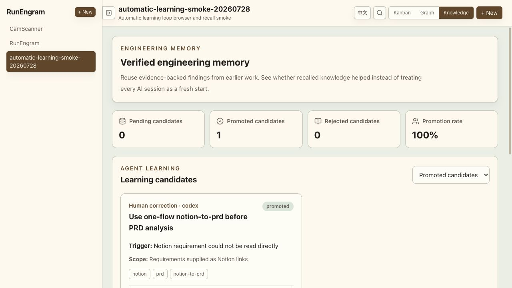
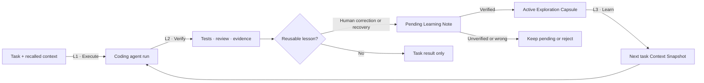
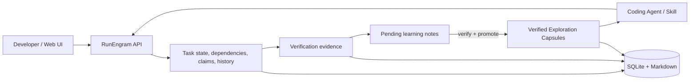

# RunEngram

[**English**](https://github.com/MoonTseng/RunEngram#readme) |
[简体中文](https://github.com/MoonTseng/RunEngram/blob/main/README.zh-CN.md#readme)

[](https://github.com/MoonTseng/RunEngram/actions/workflows/ci.yml)
[](./LICENSE)

**Verified engineering memory for coding agents.**

Make every agent run improve the next.

RunEngram connects engineering work, agent execution, verification evidence,
and reusable project context in one loop. It does not replace Codex,
Claude Code, Cursor, or your existing engineering SOP. It gives those tools
one shared source of work truth and a path for turning verified experience into
context the next task can use.

> **Status: early alpha.** Local task execution, immutable context snapshots,
> automatic learning-note capture, evidence-gated promotion, verified
> Exploration Capsules, recall, and observed reuse metrics work now.



<p align="center"><sub>Real local pilot: a verified human correction becomes reusable project memory.</sub></p>

## Why RunEngram

AI coding makes one implementation faster. RunEngram makes verified experience
compound across tasks.

| Repeated engineering cost | RunEngram response |
| --- | --- |
| Re-explain requirements and architecture in every session | Freeze task input and recalled knowledge in a Context Snapshot |
| Search the same code paths and repeat failed commands | Recall scoped, fingerprinted Exploration Capsules |
| Lose useful corrections inside chat transcripts | Capture structured Learning Notes with source and scope |
| Pollute memory with guesses or stale advice | Promote only evidence-backed candidates; reject or retain the rest |
| Guess whether AI work improved | Measure candidates, promotion, recall, and observed reuse |

## How the loop compounds



RunEngram coordinates this loop around Codex, Claude Code, Cursor, custom
agents, and existing engineering SOPs. It does not replace them.

## What works today

- **Local-first:** one Go server and one SQLite file; no Redis or PostgreSQL.
- **One work truth:** web UI, REST API, CLI, and agent skill share the same
  task state.
- **Explicit workflow:** `pending → start → spec → dev → test → review → done`.
- **Structured context:** dependency DAG, priorities, labels, Markdown docs,
  images, and links.
- **Safe agent execution:** atomic claims, leases, heartbeats, and recovery.
- **Explainable history:** append-only task events record actor, time, and
  field-level changes.
- **Evidence gates:** GitHub PR, review-thread, and CI checks protect workflow
  completion.
- **Human visibility:** Kanban and dependency-graph views.
- **Bilingual UI:** English and Simplified Chinese.
- **Immutable Context Snapshot:** each claimed task freezes its starting input
  and recalled project knowledge on first read.
- **Exploration Capsules:** verified findings retain source task, scope,
  evidence, fingerprints, and producer (`codex`, `claude-code`, or another
  tool).
- **Automatic learning candidates:** the agent skill captures human
  corrections and successful recovery paths as pending learning notes.
- **Evidence-gated promotion:** a verified pending note is atomically promoted
  into one active Exploration Capsule; rejected notes remain auditable and
  never enter recall.
- **Learning visibility:** Knowledge view and CLI show reused tasks, helpful
  outcomes, learning candidates, promotion rate, rejected knowledge, and
  helpful rate without inventing time saved.

The alpha binaries still use the names `taskline-server` and `taskline`. They
are RunEngram's task execution kernel. The public command names will be unified
before 1.0.

## Learning loop

1. **Context Snapshot** freezes task input and recalled capsules when work
   starts.
2. **Learning Note** captures a reusable candidate when a human correction
   changes the agent's plan or a failed path is replaced by a successful one.
3. **Verified Promotion** requires concrete evidence, then atomically converts
   one pending note into one active Exploration Capsule.
4. **Observed Reuse** records whether recalled memory was helpful, rejected, or
   stale.
5. **Evidence to Rule** can later promote repeated project knowledge into a
   skill, test, lint rule, template, or workflow gate.
6. **Tool-agnostic Protocol** lets different coding agents and SOPs participate
   in the same learning loop.

This is agent-driven capture, not passive transcript ingestion. Raw chats,
secrets, tokens, hidden reasoning, and unverified guesses are never copied into
project memory. Only promoted capsules enter future-task recall.

## Quick start

Requirements:

- Go
- Node.js
- pnpm

Build everything:

```bash
git clone https://github.com/MoonTseng/RunEngram.git
cd RunEngram
./scripts/build.sh
```

Start the server:

```bash
cp .env.example .env
./dist/taskline-server
```

Open:

```text
http://127.0.0.1:8787/
```

In another terminal:

```bash
export TASKLINE_PROJECT=demo

./dist/taskline status
./dist/taskline register --name agent-a
./dist/taskline project create \
  --name demo \
  --description "RunEngram demo"
./dist/taskline task create \
  --title "Create first verified task" \
  --type feature \
  --priority 1
./dist/taskline task next --claim
TASK_ID="<claimed-task-id>"
./dist/taskline task context "$TASK_ID"
```

`task next` previews work by default. An agent must use `--claim` before
starting execution.

## Use it in an existing project

Install the local CLI and public agent skill:

```bash
./scripts/install-local.sh
```

Enter the repository where the agent will work:

```bash
cd /path/to/your-project
export TASKLINE_SERVER=http://127.0.0.1:8787
export TASKLINE_PROJECT=your-project

taskline status
```

If `registered=false`, register the current working directory:

```bash
taskline register --name your-agent-name
taskline status
```

Codex (default), Claude Code, or another CLI-capable agent can now follow
[`skills/taskline-management/SKILL.md`](./skills/taskline-management/SKILL.md)
to claim, resume, update, verify, and reuse engineering memory. The installer
links the same public skill into both `~/.agents/skills/` and
`~/.claude/skills/`.

### Prompt shorthand

Use the skill name as a prompt prefix. Brackets are optional.

```text
taskline-management <requirement>
taskline-management run <requirement>
taskline-management spec <requirement>
taskline-management pending <requirement>
```

- default: create one runnable task, then stop;
- `run`: create, claim, and execute that exact task;
- `spec`: create, claim, attach a Spec, then stop before code changes;
- `pending`: create the task in the non-runnable backlog.

Chinese aliases `执行`, `方案`, and `待规划` work too. Add
`project:CamScanner` when more than one RunEngram project exists. With one
project, the skill selects it automatically.

```bash
taskline task context <task-id>
taskline learning capture --project your-project --task <task-id> \
  --kind human-correction \
  --trigger "Notion requirement could not be read directly" \
  --guidance "Use the one-flow notion-to-prd step before PRD analysis" \
  --scope "Requirements linked from Notion" --producer codex
taskline learning list --project your-project --status pending
taskline learning promote <learning-note-id> \
  --evidence-file ./verified-learning.md
taskline learning reject <learning-note-id> \
  --reason "One-off environment issue; not reusable"
taskline capsule list --project your-project --query webview
taskline capsule create --project your-project --source-task <task-id> \
  --title "Reusable boundary" --summary "Verified finding" \
  --scope "Affected module" --evidence-file ./evidence.md \
  --fingerprint module-name --producer codex
taskline capsule use <capsule-id> --task <task-id> --outcome helpful
taskline capsule metrics --project your-project
```

## Architecture



More detail:

- [Architecture](./ARCHITECTURE.md)
- [Product philosophy](./PRODUCT.md)
- [L1 / L2 / L3 agent loop](./docs/agent-loop-architecture.zh-CN.md)
- [Contributor guide](./AGENTS.md)

## Development

```bash
( cd server && go test ./... )
( cd cli && go test ./... )
( cd web && pnpm lint && pnpm test && pnpm build )
./scripts/test-skill.sh
```

Release-style build:

```bash
./scripts/build.sh
```

## Stack

- **Server:** Go, Hertz, SQLite (`modernc.org/sqlite`, no CGO)
- **CLI:** Go, Cobra
- **Web:** React, Vite, Tailwind, TanStack Query, dnd-kit, React Flow

## Contributing

RunEngram is early. Reproducible bug reports, real engineering workflow
feedback, coding-agent adapters, and measurement designs are welcome.

Before submitting changes, run tests appropriate to the modified area. Never
commit task databases, tokens, private project documents, or local runtime
data.

## License

[MIT](./LICENSE)
