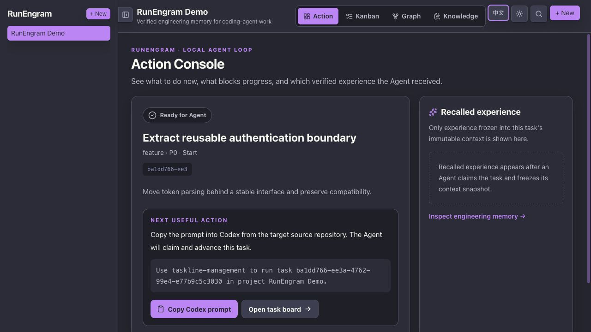
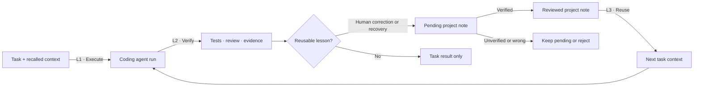
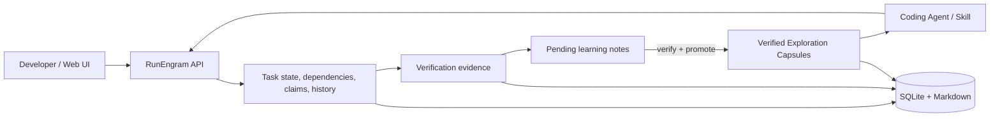

# RunEngram

[**English**](https://github.com/MoonTseng/RunEngram#readme) |
[简体中文](https://github.com/MoonTseng/RunEngram/blob/main/README.zh-CN.md#readme)

[](https://github.com/MoonTseng/RunEngram/actions/workflows/ci.yml)
[](./LICENSE)

**A local task runner and project memory for coding agents.**

RunEngram started from a problem we kept hitting in real projects: each new
Codex session needed the same requirements and architecture explained again.
Useful fixes stayed in old chats. The task board showed progress, but the next
agent still started from zero.

RunEngram keeps the task, the context given to the agent, the test evidence,
and any reusable lesson in one local store. Codex is the default client, but
the protocol also works with Claude Code or any tool that can call the CLI.

> **Early alpha.** We use it locally. Task execution, context snapshots,
> learning candidates, review, recall, and reuse metrics are implemented.
> Automatic conversion of experience into project rules is not.



<p align="center"><sub>The default view shows the current task, next action, blockers, and recalled project notes.</sub></p>

## What it is for

A task goes through four steps:

1. Write a task with enough context to execute.
2. An agent claims it and receives a fixed context snapshot.
3. Tests, review, and delivery evidence are attached to the task.
4. A useful finding can be reviewed and reused by a later task.

| Problem we saw | What RunEngram does |
| --- | --- |
| Requirements and architecture get retyped in every session | Saves the task input and recalled notes in a fixed snapshot |
| Agents search the same files and repeat failed commands | Stores findings with project scope and code fingerprints |
| Corrections disappear in chat history | Records them as reviewable learning candidates |
| Old or guessed advice leaks into later work | Requires evidence before a candidate enters project memory |
| A team cannot tell whether saved context helped | Records useful, rejected, and stale reuse outcomes |


<details>
<summary>Paper theme</summary>


</details>

## How a task moves through RunEngram



RunEngram sits outside the coding agent. Existing prompts, skills, CI, and
team SOPs stay in place.

## How it compares

The comparison uses each project's documented main purpose. It is not a
feature-by-feature scorecard.

| Capability | RunEngram | GitHub Copilot Memory | Claude Code memory | OpenHands | LinearB |
| --- | --- | --- | --- | --- | --- |
| Main job | Close task → evidence → memory loop | Store repository facts for Copilot | Persist instructions and auto memory | Execute agents in workspaces | Measure software delivery |
| Task state and agent leases | Yes | No | No | Execution sessions | Delivery workflow data |
| Immutable task context | Yes | No | No | Workspace/session context | No |
| Evidence-gated memory promotion | Yes | Citation validation | Manual files / auto memory | No | No |
| Observed memory reuse | Helpful / rejected / stale | No | No | No | No |
| Default deployment | Local single binary + SQLite | GitHub service | Local files | Local or remote runtime | SaaS |

Sources: [GitHub Copilot Memory](https://docs.github.com/en/copilot/concepts/agents/copilot-memory),
[Claude Code memory](https://docs.anthropic.com/en/docs/claude-code/memory),
[OpenHands](https://docs.openhands.dev/overview), and
[LinearB](https://linearb.io/platform/engineering-metrics).

## Implemented

- One Go server, one SQLite file, and local attachment storage.
- Web UI, REST API, CLI, and Agent Skill use the same task records.
- Task states: `pending → start → spec → dev → test → review → done`.
- Dependencies, priorities, labels, Markdown documents, images, and links.
- Atomic claims, leases, heartbeats, and interrupted-task recovery.
- Append-only task history with actor, time, and changed fields.
- GitHub PR, review-thread, and CI checks before completion.
- Action Console, Kanban, dependency graph, and engineering-memory views.
- English and Simplified Chinese UI; Dracula is the default theme.
- A fixed context snapshot when an agent starts a task.
- Project findings with source task, scope, evidence, code fingerprints, and
  producer (`codex`, `claude-code`, or another tool).
- Learning candidates for human corrections and successful recovery paths.
- Manual promotion with evidence; rejected candidates stay out of recall.
- Counts for candidates, promotions, recalled tasks, and actual reuse results.

The binaries still use the names `taskline-server` and `taskline` for
compatibility. They will be renamed before 1.0.

## How project notes are saved

1. When work starts, RunEngram saves the task input and recalled notes as a
   snapshot.
2. A human correction or a successful recovery can create a learning
   candidate.
3. The candidate needs concrete evidence before someone promotes it into
   project memory.
4. Later tasks record whether the recalled note helped, was rejected, or had
   become stale.

RunEngram does not copy whole chat transcripts. It does not store secrets,
tokens, hidden reasoning, or unreviewed guesses. Only reviewed entries are
recalled by later tasks.

## Install as a Codex plugin

The repository contains a Codex marketplace plugin. It appears in Codex
**Plugins → Marketplace**:

```bash
codex plugin marketplace add MoonTseng/RunEngram --ref main
codex plugin add runengram@runengram
```

Start a new Codex task, then ask:

```text
Set up RunEngram on this computer.
```

Setup downloads a checksum-verified release, installs it under `~/.local`,
starts a loopback-only service, and keeps project data local. To update:

```bash
codex plugin marketplace upgrade runengram
codex plugin add runengram@runengram
```

Start a new Codex task after upgrade so refreshed skills load.

## Build from source

Requirements:

- Go
- Node.js
- pnpm

Build everything:

```bash
git clone https://github.com/MoonTseng/RunEngram.git
cd RunEngram
./scripts/build.sh
```

Start the server:

```bash
cp .env.example .env
./dist/taskline-server
```

Open:

```text
http://127.0.0.1:8787/
```

In another terminal:

```bash
export TASKLINE_PROJECT=demo

./dist/taskline status
./dist/taskline register --name agent-a
./dist/taskline project create \
  --name demo \
  --description "RunEngram demo"
./dist/taskline task create \
  --title "Create first verified task" \
  --type feature \
  --priority 1
./dist/taskline task next --claim
TASK_ID="<claimed-task-id>"
./dist/taskline task context "$TASK_ID"
```

`task next` previews work by default. An agent must use `--claim` before
starting execution.

## Use it in an existing project

Install the local CLI and public agent skill:

```bash
./scripts/install-local.sh
```

Enter the repository where the agent will work:

```bash
cd /path/to/your-project
export TASKLINE_SERVER=http://127.0.0.1:8787
export TASKLINE_PROJECT=your-project

taskline status
```

If `registered=false`, register the current working directory:

```bash
taskline register --name your-agent-name
taskline status
```

Codex (default), Claude Code, or another CLI-capable agent can now follow
[`skills/taskline-management/SKILL.md`](./skills/taskline-management/SKILL.md)
to claim, resume, update, verify, and reuse engineering memory. The installer
links the same public skill into both `~/.agents/skills/` and
`~/.claude/skills/`.

### Prompt shorthand

Use the skill name as a prompt prefix. Brackets are optional.

```text
taskline-management <requirement>
taskline-management run <requirement>
taskline-management spec <requirement>
taskline-management pending <requirement>
```

- default: create one runnable task, then stop;
- `run`: create, claim, and execute that exact task;
- `spec`: create, claim, attach a Spec, then stop before code changes;
- `pending`: create the task in the non-runnable backlog.

Chinese aliases `执行`, `方案`, and `待规划` work too. Add
`project:CamScanner` when more than one RunEngram project exists. With one
project, the skill selects it automatically.

```bash
taskline task context <task-id>
taskline learning capture --project your-project --task <task-id> \
  --kind human-correction \
  --trigger "Notion requirement could not be read directly" \
  --guidance "Use the one-flow notion-to-prd step before PRD analysis" \
  --scope "Requirements linked from Notion" --producer codex
taskline learning list --project your-project --status pending
taskline learning promote <learning-note-id> \
  --evidence-file ./verified-learning.md
taskline learning reject <learning-note-id> \
  --reason "One-off environment issue; not reusable"
taskline capsule list --project your-project --query webview
taskline capsule create --project your-project --source-task <task-id> \
  --title "Reusable boundary" --summary "Verified finding" \
  --scope "Affected module" --evidence-file ./evidence.md \
  --fingerprint module-name --producer codex
taskline capsule use <capsule-id> --task <task-id> --outcome helpful
taskline capsule metrics --project your-project
```

## Architecture



More detail:

- [Architecture](./ARCHITECTURE.md)
- [Product philosophy](./PRODUCT.md)
- [L1 / L2 / L3 agent loop](./docs/agent-loop-architecture.zh-CN.md)
- [Contributor guide](./AGENTS.md)

## Development

```bash
( cd server && go test ./... )
( cd cli && go test ./... )
( cd web && pnpm lint && pnpm test && pnpm build )
./scripts/test-skill.sh
```

Release-style build:

```bash
./scripts/build.sh
```

## Stack

- **Server:** Go, Hertz, SQLite (`modernc.org/sqlite`, no CGO)
- **CLI:** Go, Cobra
- **Web:** React, Vite, Tailwind, TanStack Query, dnd-kit, React Flow

## Contributing

RunEngram is early. Reproducible bug reports, real engineering workflow
feedback, coding-agent adapters, and measurement designs are welcome.

Before submitting changes, run tests appropriate to the modified area. Never
commit task databases, tokens, private project documents, or local runtime
data.

## Privacy and data

RunEngram binds to `127.0.0.1` by default. Tasks, Markdown, attachments,
context snapshots, and engineering memory stay in the local RunEngram data
directory. Skills must never capture API tokens, credentials, raw private
chats, or hidden model reasoning.

## License

[MIT](./LICENSE)
