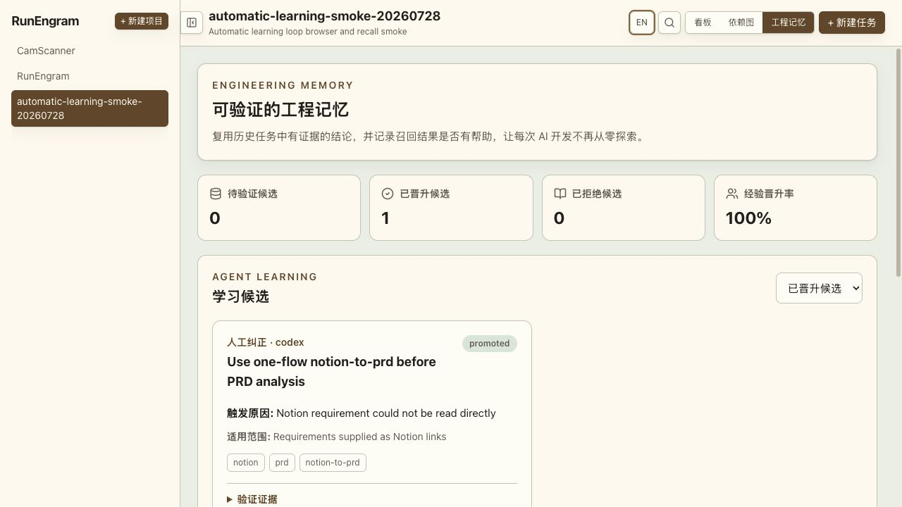
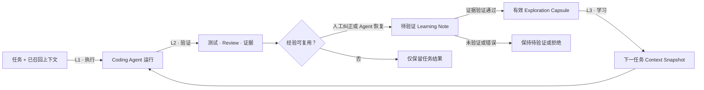
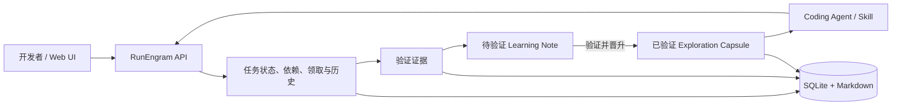

# RunEngram

[English](https://github.com/MoonTseng/RunEngram#readme) |
[**简体中文**](https://github.com/MoonTseng/RunEngram/blob/main/README.zh-CN.md#readme)

**面向 AI 编程智能体的可验证研发记忆系统。**

让每次 Agent 执行，都让下一次开发更快、更准。

RunEngram 把研发任务、Agent 执行、验证证据和可复用项目上下文连接成一个
闭环。它不替代 Codex、Claude Code、Cursor 或团队现有研发 SOP；它让这些
工具共享同一份任务事实，并逐步把验证过的经验转化为下一次开发可直接使用
的项目知识。

> **项目状态：早期 Alpha。** 本地任务执行、不可变上下文快照、可验证
> Exploration Capsule、学习候选自动捕获、基于证据的晋升、自动召回和复用
> 效果指标已经可用。



<p align="center"><sub>真实本地试运行：经过验证的人工纠正，成为后续任务可复用的项目记忆。</sub></p>

## 为什么需要 RunEngram

AI Coding 提高一次开发的速度。RunEngram 让经过验证的研发经验在任务之间持续
复利。

| 反复发生的研发成本 | RunEngram 的处理方式 |
| --- | --- |
| 每个新会话重新解释需求和架构 | 用 Context Snapshot 冻结任务输入与召回知识 |
| 不同 Agent 重复搜索代码、重试失败命令 | 召回带范围与代码指纹的 Exploration Capsule |
| 有用纠正消失在聊天记录中 | 捕获带来源与适用范围的结构化 Learning Note |
| 猜测或过期建议污染知识库 | 只有带证据的候选可以晋升，其余保持待验证或拒绝 |
| 无法判断 AI 是否产生长期收益 | 统计候选、晋升、召回与实际复用结果 |

## 学习闭环如何产生复利



RunEngram 围绕 Codex、Claude Code、Cursor、自定义 Agent 和团队现有 SOP
建立闭环，不替代这些工具。

## 当前可以使用的能力

- 本地优先：一个 Go 服务、一个 SQLite 文件，无需 Redis 或 PostgreSQL；
- 统一任务事实：网页、REST API、CLI 和 Agent Skill 使用同一份状态；
- 七阶段工作流：`pending → start → spec → dev → test → review → done`；
- 任务依赖 DAG、优先级、标签、Markdown 文档、图片和链接；
- 原子领取、租约、心跳和恢复，支持 Agent 中断后继续执行；
- 追加式任务历史，记录操作者、变更字段和发生时间；
- GitHub PR、Review 和 CI 证据门禁；
- 看板与依赖图；
- Web UI 中英文切换。
- 任务领取后首次读取会生成不可变 Context Snapshot，冻结任务输入和召回知识；
- Exploration Capsule 保存来源任务、适用范围、验证证据、代码指纹和生产工具；
- Agent Skill 会把人工纠正和成功恢复路径捕获为待验证的 Learning Note；
- 验证后的 Learning Note 原子晋升为唯一的 Exploration Capsule，拒绝项保留审计
  记录但不会进入召回；
- “工程记忆”视图与 CLI 展示学习候选、晋升率、复用任务数、有效/无效结果和
  有效复用率。

当前 Alpha 版本的二进制仍使用 `taskline-server` 和 `taskline` 命令名。
它们是 RunEngram 的任务执行内核；正式版前会完成统一命名迁移。

## RunEngram 的学习闭环

1. **Context Snapshot**：任务开始时冻结输入与本次召回的工程记忆；
2. **Learning Note**：人工纠正改变执行方案，或 Agent 从失败路径恢复成功时，
   自动记录带来源和范围的候选经验；
3. **Verified Promotion**：候选必须附上可检查的验证证据，之后原子晋升为唯一
   的 Exploration Capsule；
4. **Observed Reuse**：记录召回知识是有效、无效还是已经过期；
5. **Evidence to Rule**：重复出现的项目知识后续可继续晋升为 Skill、测试、
   Lint 规则、模板或工作流门禁；
6. **Tool-agnostic Protocol**：允许不同 Agent 和研发 SOP 接入同一学习循环。

这是由 Agent Skill 驱动的结构化捕获，不是后台偷录聊天。原始对话、令牌、
密码、隐藏推理和未验证猜测不会写入项目记忆；只有晋升后的 Capsule 才会被
后续任务召回。

## 快速开始

环境要求：

- Go
- Node.js
- pnpm

构建完整版本：

```bash
git clone https://github.com/MoonTseng/RunEngram.git
cd RunEngram
./scripts/build.sh
```

启动服务：

```bash
cp .env.example .env
./dist/taskline-server
```

打开：

```text
http://127.0.0.1:8787/
```

在另一个终端使用 CLI：

```bash
export TASKLINE_PROJECT=demo

./dist/taskline status
./dist/taskline register --name agent-a
./dist/taskline project create \
  --name demo \
  --description "RunEngram demo"
./dist/taskline task create \
  --title "Create first verified task" \
  --type feature \
  --priority 1
./dist/taskline task next --claim
TASK_ID="<领取到的任务 ID>"
./dist/taskline task context "$TASK_ID"
```

`task next` 默认只预览。Agent 真正开始执行前必须使用 `--claim`。

## 在现有项目中使用

安装本地 CLI 和 Agent Skill：

```bash
./scripts/install-local.sh
```

进入需要开发的代码仓库：

```bash
cd /path/to/your-project
export TASKLINE_SERVER=http://127.0.0.1:8787
export TASKLINE_PROJECT=your-project

taskline status
```

当 `registered=false` 时注册当前工作目录的 Agent 身份：

```bash
taskline register --name your-agent-name
taskline status
```

然后可以让 Codex（默认）、Claude Code 或其他可调用 CLI 的 Agent 按照
[`skills/taskline-management/SKILL.md`](./skills/taskline-management/SKILL.md)
领取、推进、验证并复用工程记忆。安装脚本会把同一个 Skill 链接到
`~/.agents/skills/` 与 `~/.claude/skills/`。

### 提示词短语法

直接把 Skill 名称作为提示词前缀。方括号可以省略：

```text
taskline-management 【需求描述】
taskline-management 执行 【需求描述】
taskline-management 方案 【需求描述】
taskline-management 待规划 【需求描述】
```

- 默认：创建一项可执行任务，然后停止，不修改代码；
- `执行`：创建、领取并完整执行刚创建的任务；
- `方案`：创建、领取并生成 Spec，然后在修改代码前停止；
- `待规划`：创建到不可领取的待规划区。

只有一个 RunEngram 项目时自动选择。存在多个项目时，在提示中增加
`项目:CamScanner`。英文别名分别为 `run`、`spec` 和 `pending`。

```bash
taskline task context <任务 ID>
taskline learning capture --project your-project --task <任务 ID> \
  --kind human-correction \
  --trigger "无法直接读取 Notion 需求" \
  --guidance "先调用 one-flow 的 notion-to-prd，再进入 PRD 分析" \
  --scope "Notion 链接需求" --producer codex
taskline learning list --project your-project --status pending
taskline learning promote <学习候选 ID> \
  --evidence-file ./verified-learning.md
taskline learning reject <学习候选 ID> \
  --reason "仅为单次环境问题，不可复用"
taskline capsule list --project your-project --query webview
taskline capsule create --project your-project --source-task <任务 ID> \
  --title "可复用边界" --summary "已经验证的结论" \
  --scope "适用模块" --evidence-file ./evidence.md \
  --fingerprint module-name --producer codex
taskline capsule use <胶囊 ID> --task <任务 ID> --outcome helpful
taskline capsule metrics --project your-project
```

更完整的操作说明见[中文使用指南](./使用说明.md)。

## 架构



详细实现见：

- [Architecture](./ARCHITECTURE.md)
- [Product philosophy](./PRODUCT.md)
- [L1 / L2 / L3 Agent Loop](./docs/agent-loop-architecture.zh-CN.md)
- [Contributor guide](./AGENTS.md)

## 开发与测试

```bash
( cd server && go test ./... )
( cd cli && go test ./... )
( cd web && pnpm lint && pnpm test && pnpm build )
./scripts/test-skill.sh
```

完整构建：

```bash
./scripts/build.sh
```

## 技术栈

- Server：Go、Hertz、SQLite（`modernc.org/sqlite`，无 CGO）
- CLI：Go、Cobra
- Web：React、Vite、Tailwind、TanStack Query、dnd-kit、React Flow

## 参与贡献

RunEngram 仍在早期阶段。欢迎提交可复现问题、真实研发流程反馈、Agent
适配方案和验证指标设计。

提交改动前请运行与改动范围对应的测试，并避免提交任务数据库、令牌、私有
项目文档或其他本地运行数据。

## License

[MIT](./LICENSE)
