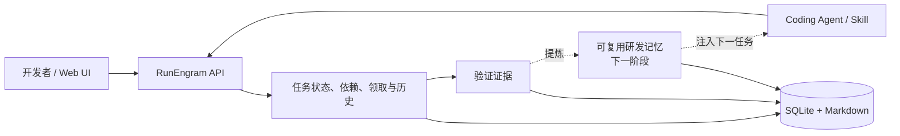

# RunEngram

[English](./README.md) | **简体中文**

**面向 AI 编程智能体的可验证研发记忆系统。**

让每次 Agent 执行，都让下一次开发更快、更准。

RunEngram 把研发任务、Agent 执行、验证证据和可复用项目上下文连接成一个
闭环。它不替代 Codex、Claude Code、Cursor 或团队现有研发 SOP；它让这些
工具共享同一份任务事实，并逐步把验证过的经验转化为下一次开发可直接使用
的项目知识。

> **项目状态：早期 Alpha。** 当前仓库已经提供本地任务执行内核；
> 可验证探索缓存、经验晋升和学习效果指标属于下一阶段能力。

## 为什么需要 RunEngram

AI Coding 提高了单次编码速度，但真实研发仍有几个反复发生的问题：

- 新会话重新解释需求、架构约束和历史决策；
- 不同 Agent 重复搜索同一批代码和依赖关系；
- 任务完成了，可靠经验却留在聊天记录里；
- 看板能显示“做到哪一步”，但不能让下一次执行更准确；
- 团队难以回答 AI 到底减少了多少探索、返工和人工操作。

RunEngram 的目标不是再做一个项目管理看板，而是建立可验证研发学习循环：

```text
任务上下文 → Agent 执行 → 证据验证 → 经验提炼 → 下一任务复用
```

## 当前可以使用的能力

- 本地优先：一个 Go 服务、一个 SQLite 文件，无需 Redis 或 PostgreSQL；
- 统一任务事实：网页、REST API、CLI 和 Agent Skill 使用同一份状态；
- 七阶段工作流：`pending → start → spec → dev → test → review → done`；
- 任务依赖 DAG、优先级、标签、Markdown 文档、图片和链接；
- 原子领取、租约、心跳和恢复，支持 Agent 中断后继续执行；
- 追加式任务历史，记录操作者、变更字段和发生时间；
- GitHub PR、Review 和 CI 证据门禁；
- 看板与依赖图；
- Web UI 中英文切换。

当前 Alpha 版本的二进制仍使用 `taskline-server` 和 `taskline` 命令名。
它们是 RunEngram 的任务执行内核；正式版前会完成统一命名迁移。

## RunEngram 的产品方向

下一阶段重点不是增加更多看板功能，而是让任务执行产生可复用收益：

1. **Context Snapshot**：任务开始时冻结需求、约束、依赖和知识版本；
2. **Exploration Capsule**：保存经过验证的代码入口、调用链、命令和失败路径；
3. **Evidence to Rule**：把重复出现的经验晋升为项目知识、Skill、测试或门禁；
4. **Learning Lift**：衡量复用知识后节省的搜索、解释、返工和人工步骤；
5. **Tool-agnostic Protocol**：允许不同 Agent 和研发 SOP 接入同一学习循环。

原始聊天记录不是可信知识。进入项目知识前，经验必须保留来源、适用范围、
验证证据、代码指纹和失效条件。

## 快速开始

环境要求：

- Go
- Node.js
- pnpm

构建完整版本：

```bash
git clone https://github.com/MoonTseng/RunEngram.git
cd RunEngram
./scripts/build.sh
```

启动服务：

```bash
cp .env.example .env
./dist/taskline-server
```

打开：

```text
http://127.0.0.1:8787/
```

在另一个终端使用 CLI：

```bash
export TASKLINE_PROJECT=demo

./dist/taskline status
./dist/taskline register --name agent-a
./dist/taskline project create \
  --name demo \
  --description "RunEngram demo"
./dist/taskline task create \
  --title "Create first verified task" \
  --type feature \
  --priority 1
./dist/taskline task next --claim
```

`task next` 默认只预览。Agent 真正开始执行前必须使用 `--claim`。

## 在现有项目中使用

安装本地 CLI 和 Agent Skill：

```bash
./scripts/install-local.sh
```

进入需要开发的代码仓库：

```bash
cd /path/to/your-project
export TASKLINE_SERVER=http://127.0.0.1:8787
export TASKLINE_PROJECT=your-project

taskline status
```

当 `registered=false` 时注册当前工作目录的 Agent 身份：

```bash
taskline register --name your-agent-name
taskline status
```

然后可以让 Codex 或其他 Agent 按照
[`skills/taskline-management/SKILL.md`](./skills/taskline-management/SKILL.md)
领取和推进任务。

更完整的操作说明见[中文使用指南](./使用说明.md)。

## 架构



详细实现见：

- [Architecture](./ARCHITECTURE.md)
- [Product philosophy](./PRODUCT.md)
- [L1 / L2 / L3 Agent Loop](./docs/agent-loop-architecture.zh-CN.md)
- [Contributor guide](./AGENTS.md)

## 开发与测试

```bash
( cd server && go test ./... )
( cd cli && go test ./... )
( cd web && pnpm lint && pnpm test && pnpm build )
./scripts/test-skill.sh
```

完整构建：

```bash
./scripts/build.sh
```

## 技术栈

- Server：Go、Hertz、SQLite（`modernc.org/sqlite`，无 CGO）
- CLI：Go、Cobra
- Web：React、Vite、Tailwind、TanStack Query、dnd-kit、React Flow

## 参与贡献

RunEngram 仍在早期阶段。欢迎提交可复现问题、真实研发流程反馈、Agent
适配方案和验证指标设计。

提交改动前请运行与改动范围对应的测试，并避免提交任务数据库、令牌、私有
项目文档或其他本地运行数据。

## License

[MIT](./LICENSE)
