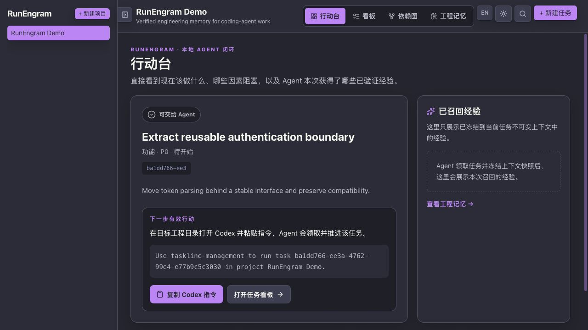
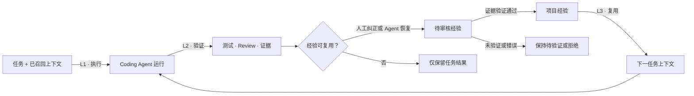
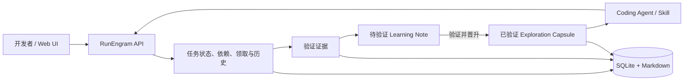

# RunEngram

[English](https://github.com/MoonTseng/RunEngram#readme) |
[**简体中文**](https://github.com/MoonTseng/RunEngram/blob/main/README.zh-CN.md#readme)

**给 Coding Agent 用的本地任务和项目经验工具。**

这个项目来自我们在实际开发中反复遇到的几个问题：每次新开 Codex 都要重新
解释需求和架构；排查结论留在旧对话里；看板记录了任务进度，但下一个 Agent
仍然从头搜索代码。

RunEngram 把任务、Agent 收到的上下文、测试证据和可复用结论保存在同一个
本地服务里。默认配合 Codex 使用，也可以接 Claude Code 或其他能调用 CLI
的工具。

> **当前状态：早期 Alpha。** 我们正在本地试用。任务执行、上下文快照、
> 经验候选、人工审核、召回和复用统计已经实现；自动生成项目规则还没有做。



<p align="center"><sub>默认页面直接显示当前任务、下一步、阻塞项和召回的项目经验。</sub></p>

## 它具体做什么

一次任务只走四步：

1. 开发者写清任务和验收条件；
2. Agent 领取任务，并拿到一份固定的上下文快照；
3. 测试、Review 和交付证据跟着任务保存；
4. 有复用价值的结论经过确认后，供后面的任务使用。

| 我们遇到的问题 | RunEngram 的处理方式 |
| --- | --- |
| 每次新会话都要重讲需求和架构 | 保存任务输入和本次召回内容，执行中不再漂移 |
| 不同 Agent 重复搜索代码、重试失败命令 | 按项目范围和代码指纹保存排查结论 |
| 有用纠正消失在聊天记录里 | 记录为待审核的经验候选 |
| 猜测或过期建议混进知识库 | 没有验证证据的内容不能进入项目记忆 |
| 不知道保存的经验有没有帮助 | 记录有效、无效和过期三种复用结果 |


<details>
<summary>浅色主题</summary>


</details>

## 一次任务怎么走



RunEngram 位于 Coding Agent 外部。原来的提示词、Skill、CI 和团队 SOP
可以继续使用。

## 和现有工具的区别

下表只比较各工具官方文档里的主要用途，不做笼统的优劣排名。

| 能力 | RunEngram | GitHub Copilot Memory | Claude Code memory | OpenHands | LinearB |
| --- | --- | --- | --- | --- | --- |
| 核心作用 | 闭合任务 → 证据 → 记忆 | 保存 Copilot 仓库事实 | 持久化指令与自动记忆 | 在工作区执行 Agent | 度量软件交付 |
| 任务状态与 Agent 租约 | 支持 | 不支持 | 不支持 | 执行会话 | 交付流程数据 |
| 不可变任务上下文 | 支持 | 不支持 | 不支持 | 工作区/会话上下文 | 不支持 |
| 基于证据的记忆晋升 | 支持 | 引用校验 | 人工文件/自动记忆 | 不支持 | 不支持 |
| 记忆复用效果观测 | 有效/无效/过期 | 不支持 | 不支持 | 不支持 | 不支持 |
| 默认部署 | 本地单二进制 + SQLite | GitHub 服务 | 本地文件 | 本地或远端运行时 | SaaS |

资料：[GitHub Copilot Memory](https://docs.github.com/en/copilot/concepts/agents/copilot-memory)、
[Claude Code memory](https://docs.anthropic.com/en/docs/claude-code/memory)、
[OpenHands](https://docs.openhands.dev/overview)、
[LinearB](https://linearb.io/platform/engineering-metrics)。

## 已经实现

- 一个 Go 服务、一个 SQLite 文件，附件也保存在本机；
- 网页、REST API、CLI 和 Agent Skill 使用同一份任务数据；
- 七个任务阶段：`pending → start → spec → dev → test → review → done`；
- 依赖关系、优先级、标签、Markdown 文档、图片和链接；
- 原子领取、租约、心跳和中断恢复；
- 只追加的任务历史，记录操作者、时间和具体改动；
- 支持不使用 GitHub PR 或 CI 的团队手动评审和完成任务；有交付证据时仍可附加链接与验证文档；
- 行动台、看板、依赖图和工程记忆页面；
- 中英文切换，默认使用 Dracula 深色主题；
- Agent 开始任务时生成固定的上下文快照；
- 项目经验保存来源任务、适用范围、证据、代码指纹和执行工具；
- 人工纠正和成功恢复可以记录为经验候选；
- 候选经过人工确认和证据验证后才进入项目记忆；
- 统计候选、晋升、召回任务数和实际复用结果。

为了兼容现有脚本，二进制目前仍叫 `taskline-server` 和 `taskline`，1.0 前
会统一命名。

## 项目经验怎么保存

1. 任务开始时，保存任务输入和本次召回内容；
2. 人工纠正或一次成功的失败恢复，可以生成经验候选；
3. 候选必须附上具体证据，并由人确认后才能进入项目记忆；
4. 后续任务记录这条经验是否有效、被拒绝或已经过期。

RunEngram 不会复制完整聊天记录，也不保存密码、Token、隐藏推理或未经确认
的猜测。后续任务只会召回审核过的经验。

## 作为 Codex 插件安装

仓库包含一个 Codex 市场插件，安装后会出现在 **插件 → 市场**：

```bash
codex plugin marketplace add MoonTseng/RunEngram --ref main
codex plugin add runengram@runengram
```

两个命令都要执行：第一个只添加市场源，第二个才安装插件。普通使用者不需要
运行 `plugin-creator`。先确认 `runengram@runengram` 显示为
`installed, enabled`：

```bash
codex plugin list
```

完全退出并重新打开 Codex，新建任务后输入：

```text
在这台电脑上安装并启动 RunEngram。
```

安装过程会下载带校验和的 Release，安装到 `~/.local`，启动仅监听本机回环
地址的服务；项目数据仍保存在本机。安装后可以输入
`taskline-management 【需求描述】`，或从 Skill 列表选择
**Taskline Management**。它是 Skill 触发词，不是终端命令。首次在 Git
工程中使用时，RunEngram 会读取仓库名并自动创建对应项目，不再询问项目名。
首次领取任务时也会自动注册当前工作区的 Codex 身份，不再询问代理名称。
升级：

```bash
codex plugin marketplace upgrade runengram
codex plugin add runengram@runengram
```

升级后完全重启 Codex 并新建任务，使新版 Skills 生效。

## 从源码构建

环境要求：

- Go
- Node.js
- pnpm

构建完整版本：

```bash
git clone https://github.com/MoonTseng/RunEngram.git
cd RunEngram
./scripts/build.sh
```

启动服务：

```bash
cp .env.example .env
./dist/taskline-server
```

打开：

```text
http://127.0.0.1:8787/
```

在另一个终端使用 CLI：

```bash
export TASKLINE_PROJECT=demo

./dist/taskline status
./dist/taskline register --name agent-a
./dist/taskline project create \
  --name demo \
  --description "RunEngram demo"
./dist/taskline task create \
  --title "Create first verified task" \
  --type feature \
  --priority 1
./dist/taskline task next --claim
TASK_ID="<领取到的任务 ID>"
./dist/taskline task context "$TASK_ID"
```

`task next` 默认只预览。Agent 真正开始执行前必须使用 `--claim`。

## 在现有项目中使用

安装本地 CLI 和 Agent Skill：

```bash
./scripts/install-local.sh
```

进入需要开发的代码仓库：

```bash
cd /path/to/your-project
export TASKLINE_SERVER=http://127.0.0.1:8787
export TASKLINE_PROJECT=your-project

taskline status
```

当 `registered=false` 时注册当前工作目录的 Agent 身份：

```bash
taskline register --name your-agent-name
taskline status
```

然后可以让 Codex（默认）、Claude Code 或其他可调用 CLI 的 Agent 按照
[`skills/taskline-management/SKILL.md`](./skills/taskline-management/SKILL.md)
领取、推进、验证并复用工程记忆。安装脚本会把同一个 Skill 链接到
`~/.agents/skills/` 与 `~/.claude/skills/`。

### 提示词短语法

直接把 Skill 名称作为提示词前缀。方括号可以省略：

```text
taskline-management 【需求描述】
taskline-management 执行 【需求描述】
taskline-management 方案 【需求描述】
taskline-management 待规划 【需求描述】
```

- 默认：创建一项可执行任务，然后停止，不修改代码；
- `执行`：创建、领取并完整执行刚创建的任务；
- `方案`：创建、领取并生成 Spec，然后在修改代码前停止；
- `待规划`：创建到不可领取的待规划区。

只有一个 RunEngram 项目时自动选择。存在多个项目时，在提示中增加
`项目:CamScanner`。英文别名分别为 `run`、`spec` 和 `pending`。

```bash
taskline task context <任务 ID>
taskline learning capture --project your-project --task <任务 ID> \
  --kind human-correction \
  --trigger "无法直接读取 Notion 需求" \
  --guidance "先调用 one-flow 的 notion-to-prd，再进入 PRD 分析" \
  --scope "Notion 链接需求" --producer codex
taskline learning list --project your-project --status pending
taskline learning promote <学习候选 ID> \
  --evidence-file ./verified-learning.md
taskline learning reject <学习候选 ID> \
  --reason "仅为单次环境问题，不可复用"
taskline capsule list --project your-project --query webview
taskline capsule create --project your-project --source-task <任务 ID> \
  --title "可复用边界" --summary "已经验证的结论" \
  --scope "适用模块" --evidence-file ./evidence.md \
  --fingerprint module-name --producer codex
taskline capsule use <胶囊 ID> --task <任务 ID> --outcome helpful
taskline capsule metrics --project your-project
```

更完整的操作说明见[中文使用指南](./使用说明.md)。

## 架构



详细实现见：

- [Architecture](./ARCHITECTURE.md)
- [Product philosophy](./PRODUCT.md)
- [L1 / L2 / L3 Agent Loop](./docs/agent-loop-architecture.zh-CN.md)
- [Contributor guide](./AGENTS.md)

## 开发与测试

```bash
( cd server && go test ./... )
( cd cli && go test ./... )
( cd web && pnpm lint && pnpm test && pnpm build )
./scripts/test-skill.sh
```

完整构建：

```bash
./scripts/build.sh
```

## 技术栈

- Server：Go、Hertz、SQLite（`modernc.org/sqlite`，无 CGO）
- CLI：Go、Cobra
- Web：React、Vite、Tailwind、TanStack Query、dnd-kit、React Flow

## 参与贡献

RunEngram 仍在早期阶段。欢迎提交可复现问题、真实研发流程反馈、Agent
适配方案和验证指标设计。

提交改动前请运行与改动范围对应的测试，并避免提交任务数据库、令牌、私有
项目文档或其他本地运行数据。

## 隐私与数据

RunEngram 默认仅监听 `127.0.0.1`。任务、Markdown、附件、上下文快照和工程
记忆保存在本机 RunEngram 数据目录。Skill 禁止捕获 API Token、账号凭证、
原始私聊或模型隐藏推理。

## License

[MIT](./LICENSE)
