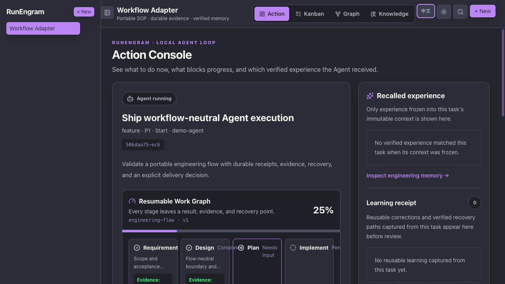
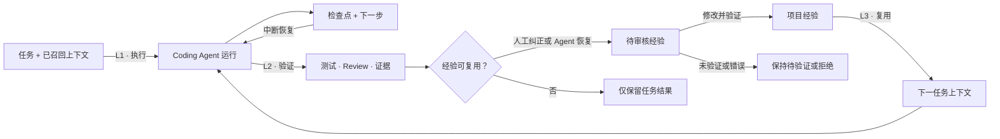
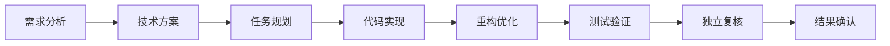
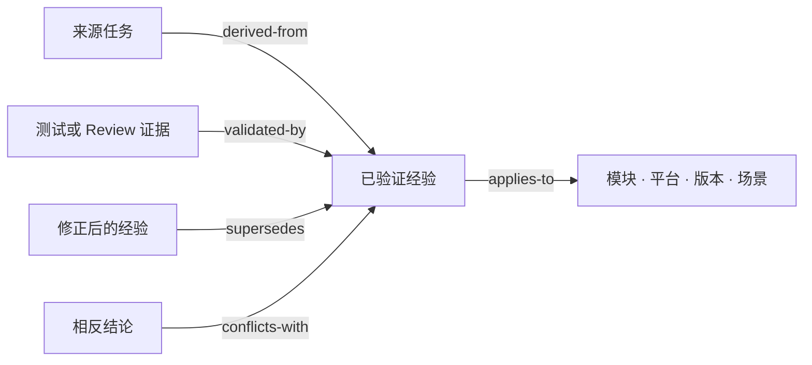
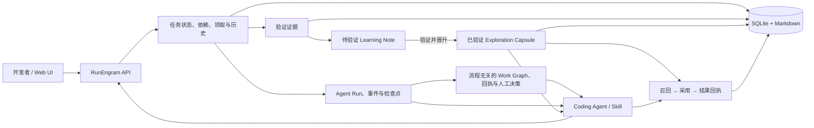

# RunEngram

[English](https://github.com/MoonTseng/RunEngram#readme) |
[**简体中文**](https://github.com/MoonTseng/RunEngram/blob/main/README.zh-CN.md#readme)

**给 Coding Agent 用的本地任务和项目经验工具。**

这个项目来自我们在实际开发中反复遇到的几个问题：每次新开 Codex 都要重新
解释需求和架构；排查结论留在旧对话里；看板记录了任务进度，但下一个 Agent
仍然从头搜索代码。

RunEngram 把任务、Agent 收到的上下文、测试证据和可复用结论保存在同一个
本地服务里。默认配合 Codex 使用，也可以接 Claude Code 或其他能调用 CLI
的工具。

> **当前状态：早期 Alpha。** 我们正在本地试用。可恢复 Agent 执行、
> 与具体流程无关的 Work Graph、上下文快照、阶段回执、人工决策、经验审核、召回和
> 复用统计已经实现。开发者决定候选是全局项目规则还是场景经验；RunEngram
> 不会把未经确认的猜测自动变成规则。



<p align="center"><sub>默认 Dracula 页面直接显示当前阶段、证据、交付物、待处理决策和召回经验。</sub></p>

## 它具体做什么

一次任务走五步：

1. 开发者写清任务和验收条件；
2. Agent 领取任务，并拿到一份固定的上下文快照；
3. 复杂研发改动可以走持久化 Work Graph；需求分析、方案、实现、验证和
   Review 每一步都会留下回执；
4. 测试、Review 和交付证据跟着任务保存；
5. 项目约定、人工纠正和已验证恢复路径先成为可编辑候选，审核后才给后面的任务使用。

| 我们遇到的问题 | RunEngram 的处理方式 |
| --- | --- |
| 每次新会话都要重讲需求和架构 | 保存任务输入和本次召回内容，执行中不再漂移 |
| 长任务中断或换 Codex 会话后要重新理解 | 恢复最近检查点、下一步和执行事件 |
| 多阶段任务一直在“执行中”，看不出完成了什么 | 展示当前阶段、依赖、交付物、验证证据和待处理人工决策 |
| 不同 Agent 重复搜索代码、重试失败命令 | 按项目范围和代码指纹保存排查结论 |
| 有用纠正消失在聊天记录里 | 记录为待审核的经验候选 |
| 不知道系统到底记住了什么 | 行动台展示学习回执，待验证候选支持人工修改 |
| 猜测或过期建议混进知识库 | 没有验证证据的内容不能进入项目记忆 |
| 经验是对的，但来源、范围和替代关系说不清 | 用类型化关系保存来源、适用范围、验证、冲突和替代关系 |
| 不知道保存的经验有没有帮助 | 记录有效、无效和过期三种复用结果 |


<details>
<summary>浅色主题</summary>


</details>

## 一次任务怎么走



RunEngram 位于 Coding Agent 外部。原来的提示词、Skill、CI 和团队 SOP
可以继续使用。

## 接入你已有的流程

RunEngram 不再造一套研发流程。它给项目已经在用的 SOP 增加持久化外层。
内置 `engineering-flow` 提供一套通用的八阶段模板：



Codex、Claude Code、Pi 或其他 Agent 仍在每个节点内自主读代码、改代码和
测试。项目自己的 Skill、命令或人工规范继续负责领域行为。RunEngram 只保存
跨会话必须保留的依赖、结论、交付物、输入版本、验证证据和人工问题。

其他流程通过 JSON Workflow Adapter 接入：

```bash
runengram run start <任务 ID> --agent-tool claude-code \
  --workflow content-review \
  --workflow-file examples/workflows/content-review.json
```

适配文件声明模板名、版本、节点能力、节点类型和依赖关系。RunEngram 校验 DAG
并保存运行状态，不执行也不复制原有 SOP。详见
[Workflow Adapter 设计](./docs/design/2026-07-29-workflow-adapters.md)。

Work Graph 不是每项任务都强制开启。跨会话、存在独立分支、中间结果重建成本高
或需要人工门禁时再使用；小修复和短任务继续走单 Agent loop。

因此界面展示的不再只是“Agent 在运行”，而是已经完成几个阶段、几个阶段有
证据、关联了多少交付物、召回了多少项目经验、还有几个决策等待处理。所有
数字来自实际回执，不虚构“节省了多少小时”。

## 和现有工具的区别

下表只比较各工具官方文档里的主要用途，不做笼统的优劣排名。

| 能力 | RunEngram | GitHub Copilot Memory | Claude Code memory | OpenHands | LinearB |
| --- | --- | --- | --- | --- | --- |
| 核心作用 | 闭合任务 → 证据 → 记忆 | 保存 Copilot 仓库事实 | 持久化指令与自动记忆 | 在工作区执行 Agent | 度量软件交付 |
| 任务状态与 Agent 租约 | 支持 | 不支持 | 不支持 | 执行会话 | 交付流程数据 |
| 持久化多阶段 Work Graph | 内置或自定义流程、回执与人工决策 | 不支持 | 不支持 | Agent workflow | 仅交付流程 |
| 可恢复执行检查点 | 工具无关协议 | 不支持 | 会话记录 | 会话状态 | 不支持 |
| 不可变任务上下文 | 支持 | 不支持 | 不支持 | 工作区/会话上下文 | 不支持 |
| 基于证据的记忆晋升 | 支持 | 引用校验 | 人工文件/自动记忆 | 不支持 | 不支持 |
| 类型化记忆来源与替代 | 来源、范围、证据、冲突、替代 | 引用 | 不支持 | 不支持 | 不支持 |
| 单次召回可解释 | 原因、得分、警告、上下文版本 | 引用 | 不支持 | 不支持 | 不支持 |
| 记忆复用效果观测 | 有效/无效/过期 | 不支持 | 不支持 | 不支持 | 不支持 |
| 默认部署 | 本地单二进制 + SQLite | GitHub 服务 | 本地文件 | 本地或远端运行时 | SaaS |

资料：[GitHub Copilot Memory](https://docs.github.com/en/copilot/concepts/agents/copilot-memory)、
[Claude Code memory](https://docs.anthropic.com/en/docs/claude-code/memory)、
[OpenHands](https://docs.openhands.dev/overview)、
[LinearB](https://linearb.io/platform/engineering-metrics)。

## 已经实现

- 一个 Go 服务、一个 SQLite 文件，附件也保存在本机；
- 网页、REST API、CLI 和 Agent Skill 使用同一份任务数据；
- 七个任务阶段：`pending → start → spec → dev → test → review → done`；
- 依赖关系、优先级、标签、Markdown 文档、图片和链接；
- 原子领取、租约、心跳和中断恢复；
- Codex、Claude Code、Pi 或其他执行器共用一套 Agent Run：规范化事件、
  精简检查点、恢复上下文和完成状态；
- 可选内置 `engineering-flow` 和自定义 JSON Workflow Adapter：带依赖
  检查的阶段、交付物、证据、类型化人工决策和完整恢复状态；
- 只追加的任务历史，记录操作者、时间和具体改动；
- 支持不使用 GitHub PR 或 CI 的团队手动评审和完成任务；有交付证据时仍可附加链接与验证文档；
- 行动台、看板、依赖图和工程记忆页面；
- 中英文切换，默认使用 Dracula 深色主题；
- Agent 开始任务时生成固定的上下文快照；
- 已审核记忆分为两层：项目规则使用独立任务预算，场景经验按相关性召回；
- 不再固定只取五条。执行中发现新模块、错误或工具时，Agent 可再次动态召回；
- 项目经验保存来源任务、适用范围、证据、代码指纹和执行工具；
- 人工纠正和成功恢复可以记录为经验候选；
- 用户明确给出的可复用项目约定也会生成候选；
- 待验证经验可修改触发条件、建议做法和适用范围；重要纠正通过新经验替代旧经验，
  两个版本都会保留；
- 类型化记忆关系保存 `derived-from`、`validated-by`、`applies-to`、
  `supersedes`、`conflicts-with` 和 `caused-by`，不需要额外图数据库；
- 每次召回返回上下文版本、匹配原因、得分和冲突警告，Agent 能说明为什么采用
  某条经验；
- 每条被召回的项目规则和场景经验都会生成影响回执，明确区分“进入上下文”、
  “实际采用”和“验证有效”，不再把召回直接当作提效；
- 已晋升经验使用乐观并发更新，旧浏览器页面不会覆盖其他人刚完成的纠正；
- 候选经过人工确认和证据验证后才进入项目记忆；
- 展示召回 → 采用 → 确认漏斗、任务级决策、验证证据和单条经验的影响历史；
- 统计执行次数、完成率、阻塞恢复率、候选、晋升、召回覆盖率、采用率、
  确认率和实际结果。

正式二进制名称已经统一为 `runengram-server` 和 `runengram`。发布包仍提供
`taskline-server`、`taskline` 兼容软链接，现有自动化可以逐步迁移。

## 项目经验怎么保存

1. 任务开始时保存任务输入和本次召回内容，并创建或恢复 Agent Run；
2. 阶段变化、阻塞和中断时保存检查点；
3. 可复用项目约定、人工纠正或成功恢复路径生成待验证经验；
4. 开发者可以修改它的触发条件、建议做法和适用范围；
5. 候选附上证据后由人选择类型：项目规则广泛适用，场景经验按相关性召回；
6. 后续每次召回先记录哪些经验进入 Agent 上下文以及召回原因；
7. Agent 或开发者记录它是否改变了执行，或者为何不适用；
8. 验证阶段用命令、文档、事件、链接、代码位置或观察结果确认它有效、无效或
   已过期；不同任务的复用结果会更新可信度和验证状态。

RunEngram 不会复制完整聊天记录，也不保存密码、Token、隐藏推理或未经确认
的猜测。后续任务只会召回审核过的经验。

### 什么时候自动记录

| 信息 | 处理方式 |
| --- | --- |
| 明确、可复用的项目约定，例如 `7.23.0_feat/<名称>` | 生成待验证经验 |
| 人工纠正改变了执行路径 | 生成待验证经验 |
| 失败路径被已验证的可复用路径替代 | 生成待验证经验 |
| 常规文件读取、成功命令、临时路径、仅本任务适用的措辞 | 只进入执行事件或检查点 |
| 已召回经验再次被使用 | 记录复用结果，不重复创建经验 |
| 密码、Token、原始聊天、隐藏推理、未经验证的猜测 | 不进入工程记忆 |

当前任务的行动台会显示“学习回执”；工程记忆页展示来源任务和待验证候选，
并支持人工编辑。待验证经验不会影响其他任务。

### 如何看到经验是否真正被复用

“被召回”不等于“有效”。RunEngram 为每个任务和每条召回经验保留一份影响回执：

| 回执状态 | 含义 |
| --- | --- |
| 已召回 | 进入任务初始上下文或执行中的动态召回 |
| 已采用 | 改变了决策、命令、文件范围或实现路线 |
| 已忽略 | Agent 已检查，并记录了不适用原因 |
| 有效 | 验证证据确认这条经验帮助或正确约束了执行 |
| 无效 | 当前任务证据与经验结论冲突 |
| 已过期 | 当前代码或规范使原本有效的经验失效 |
| 未确认 | 任务结束时仍未记录采用、忽略或最终结果 |

任务详情展示匹配到的规则、召回原因、采用阶段、执行者、说明和证据；**工程记忆**
同时展示项目级漏斗和每条经验在不同任务中的影响历史。例如“Agent 遵守经验，
没有执行被禁止的全量 Gradle 编译”会成为可核对回执，不再只存在聊天记录里。

指标只使用真实回执：

- **召回覆盖率**：召回过经验的已完成 Agent 任务 ÷ 已完成 Agent 任务；
- **采用率**：至少采用一条经验的任务 ÷ 召回过经验的任务；
- **确认率**：记录有效、无效或过期结果的任务 ÷ 采用或已有最终结论的任务。

历史上下文快照只能回填为“已召回”。RunEngram 不猜测过去是否采用、是否有效，
也不虚构节省时长。

### 如何确认经验有效

| 状态 | 含义 | 对后续任务的影响 |
| --- | --- | --- |
| 待验证 | 看起来有用，但还没审核 | 永不召回 |
| 已验证 | 开发者提供证据并启用 | 可以进入后续任务 |
| 可信 | 至少在两个任务级复用结果中被确认有效 | 同等相关性下优先 |
| 有争议 | 至少两次无效，且无效次数多于有效次数 | 保留供修正，不再自动召回 |
| 已过期 | 当前代码或工具已证明不再成立 | 不再召回 |

同一任务对同一条经验只保留一个结果，不能靠重复点击“有效”刷高可信度。
经验仅仅进入上下文时不能标记为“有效”。初始可信度为 0.60；有效一次加
0.10，无效一次减 0.15，过期归零。这表示
实际复用可信度，不虚构“节省了多少小时”。

审核待验证经验时，进入**工程记忆**并选择核对方式：命令或测试、代码或配置、
已审核文档、问题复现与修复、项目已有约定。证据只需写清两个事实：

1. **核对对象**：执行的命令、查看的文件路径、文档、复现现象或已有约定；
2. **观察结果**：测试是否通过、代码中实际存在什么、修复前后有什么变化，
   或该约定已经在哪些地方使用。

界面会列出来源任务中的文档、链接和最近事件。点击材料可自动填入核对对象，
开发者只需补充实际观察结果。证据可复查前，**确认有效并用于后续任务**保持
禁用，避免把“看起来正确”当成项目经验。

### 经验之间如何连接

RunEngram 保存小而明确的审核记录，并用类型化关系连接：



底层仍是本地 SQLite 邻接表，不引入新的图服务。`supersedes` 会让旧经验过期；
冲突经验则保留并在召回时给出警告。召回综合项目规则、相关场景经验、
`applies-to` 范围、可信度和实际复用结果，不是看不见原因的固定 top-k。

修改经验时会携带页面最后看到的更新时间。若另一名审核者已经先修改，
RunEngram 返回冲突并要求刷新，不会静默丢失任一方的纠正。

Agent 通过 CLI 使用同一套并发保护：

```bash
runengram capsule edit <经验 ID> \
  --expected-updated-at <updated_at 毫秒值> \
  --summary "<修正后的经验>"
```

## 作为 Codex 插件安装

仓库包含一个 Codex 市场插件，安装后会出现在 **插件 → 市场**：

```bash
codex plugin marketplace add MoonTseng/RunEngram --ref main
codex plugin add runengram@runengram
```

两个命令都要执行：第一个只添加市场源，第二个才安装插件。普通使用者不需要
运行 `plugin-creator`。先确认 `runengram@runengram` 显示为
`installed, enabled`：

```bash
codex plugin list
```

完全退出并重新打开 Codex，新建任务后输入：

```text
在这台电脑上安装并启动 RunEngram。
```

安装过程会下载与插件基础版本一致、带校验和的 Release，安装到 `~/.local`，
启动仅监听本机回环地址的服务；项目数据仍保存在本机。安装后可以输入
`taskline-management 【需求描述】`，或从 Skill 列表选择
**Taskline Management**。它是 Skill 触发词，不是终端命令。首次在 Git
工程中使用时，RunEngram 会读取仓库名并自动创建对应项目，不再询问项目名。
首次领取任务时也会自动注册当前工作区的 Codex 身份，不再询问代理名称。
升级：

```bash
codex plugin marketplace upgrade runengram
codex plugin add runengram@runengram
```

升级后完全重启 Codex 并新建任务，使新版 Skills 生效。

## 从源码构建

环境要求：

- Go
- Node.js
- pnpm

构建完整版本：

```bash
git clone https://github.com/MoonTseng/RunEngram.git
cd RunEngram
./scripts/build.sh
```

启动服务：

```bash
cp .env.example .env
./dist/runengram-server
```

打开：

```text
http://127.0.0.1:8787/
```

在另一个终端使用 CLI：

```bash
export TASKLINE_PROJECT=demo

./dist/runengram status
./dist/runengram register --name agent-a
./dist/runengram project create \
  --name demo \
  --description "RunEngram demo"
./dist/runengram task create \
  --title "Create first verified task" \
  --type feature \
  --priority 1
./dist/runengram task next --claim
TASK_ID="<领取到的任务 ID>"
./dist/runengram task context "$TASK_ID"
./dist/runengram run start "$TASK_ID" --agent-tool codex \
  --workflow engineering-flow
RUN_ID="<上一条输出中的 run id>"
./dist/runengram run node "$RUN_ID" requirement-analysis \
  --status completed \
  --summary "需求范围和验收标准已确认" \
  --evidence "需求契约已复核"
./dist/runengram run graph "$RUN_ID"
```

`task next` 默认只预览。Agent 真正开始执行前必须使用 `--claim`。

## 在现有项目中使用

安装本地 CLI 和 Agent Skill：

```bash
./scripts/install-local.sh
```

进入需要开发的代码仓库：

```bash
cd /path/to/your-project
export TASKLINE_SERVER=http://127.0.0.1:8787
export TASKLINE_PROJECT=your-project

runengram status
```

当 `registered=false` 时注册当前工作目录的 Agent 身份：

```bash
runengram register --name your-agent-name
runengram status
```

然后可以让 Codex（默认）、Claude Code 或其他可调用 CLI 的 Agent 按照
[`skills/taskline-management/SKILL.md`](./skills/taskline-management/SKILL.md)
领取、推进、验证并复用工程记忆。安装脚本会把同一个 Skill 链接到
`~/.agents/skills/` 与 `~/.claude/skills/`。

### 提示词短语法

直接把 Skill 名称作为提示词前缀。方括号可以省略：

```text
taskline-management 【需求描述】
taskline-management 执行 【需求描述】
taskline-management 方案 【需求描述】
taskline-management 待规划 【需求描述】
```

- 默认：创建一项可执行任务，然后停止，不修改代码；
- `执行`：创建、领取并完整执行刚创建的任务；复杂工作可以把项目已有流程
  包在持久化 Work Graph 中，小任务仍走单 loop；
- `方案`：创建、领取并生成 Spec，然后在修改代码前停止；
- `待规划`：创建到不可领取的待规划区。

只有一个 RunEngram 项目时自动选择。存在多个项目时，在提示中增加
`项目:CamScanner`。英文别名分别为 `run`、`spec` 和 `pending`。

```bash
runengram task context <任务 ID>
runengram learning capture --project your-project --task <任务 ID> \
  --kind human-correction \
  --trigger "无法直接读取 Notion 需求" \
  --guidance "先调用项目的需求导入步骤，再进入 PRD 分析" \
  --scope "Notion 链接需求" --producer codex
runengram learning list --project your-project --status pending
runengram learning edit <学习候选 ID> \
  --trigger "为 7.23.0 创建功能分支" \
  --guidance "使用 7.23.0_feat/<英文需求名>" \
  --scope "功能分支"
runengram learning promote <学习候选 ID> \
  --memory-class project-rule \
  --evidence-file ./verified-learning.md
runengram learning reject <学习候选 ID> \
  --reason "仅为单次环境问题，不可复用"
runengram capsule list --project your-project --query webview
runengram task recall <任务 ID> --query "Gradle daemon 在多个模块编译时失败"
runengram capsule create --project your-project --source-task <任务 ID> \
  --memory-class experience --trigger "删除兼容服务" \
  --title "可复用边界" --summary "已经验证的结论" \
  --scope "适用模块" --evidence-file ./evidence.md \
  --fingerprint module-name --producer codex
runengram capsule use <胶囊 ID> --task <任务 ID> --outcome used \
  --stage dev --notes "改变了验证路线"
runengram capsule use <胶囊 ID> --task <任务 ID> --outcome helpful \
  --stage test --notes "聚焦检查通过" \
  --evidence-kind command --evidence-ref "./gradlew :module:test" \
  --evidence-summary "退出码为 0"
runengram capsule metrics --project your-project
runengram task resume <任务 ID>
runengram project delete temporary-smoke-project
```

更完整的操作说明见[中文使用指南](./使用说明.md)。

## 架构



详细实现见：

- [Architecture](./ARCHITECTURE.md)
- [Product philosophy](./PRODUCT.md)
- [Workflow Adapter 与 Work Graph 设计](./docs/design/2026-07-29-workflow-adapters.md)
- [Graph Engineering 调研](./docs/research/graph-engineering-2026.md)
- [L1 / L2 / L3 Agent Loop](./docs/agent-loop-architecture.zh-CN.md)
- [Contributor guide](./AGENTS.md)

## 开发与测试

```bash
( cd server && go test ./... )
( cd cli && go test ./... )
( cd web && pnpm lint && pnpm test && pnpm build )
./scripts/test-skill.sh
./scripts/test-plugin-installer.sh
```

完整构建：

```bash
./scripts/build.sh
```

## 技术栈

- Server：Go、Hertz、SQLite（`modernc.org/sqlite`，无 CGO）
- CLI：Go、Cobra
- Web：React、Vite、Tailwind、TanStack Query、dnd-kit、React Flow

## 参与贡献

RunEngram 仍在早期阶段。欢迎提交可复现问题、真实研发流程反馈、Agent
适配方案和验证指标设计。

提交改动前请运行与改动范围对应的测试，并避免提交任务数据库、令牌、私有
项目文档或其他本地运行数据。

## 隐私与数据

RunEngram 默认仅监听 `127.0.0.1`。任务、Markdown、附件、上下文快照和工程
记忆保存在本机 RunEngram 数据目录。Skill 禁止捕获 API Token、账号凭证、
原始私聊或模型隐藏推理。

## License

[MIT](./LICENSE)
