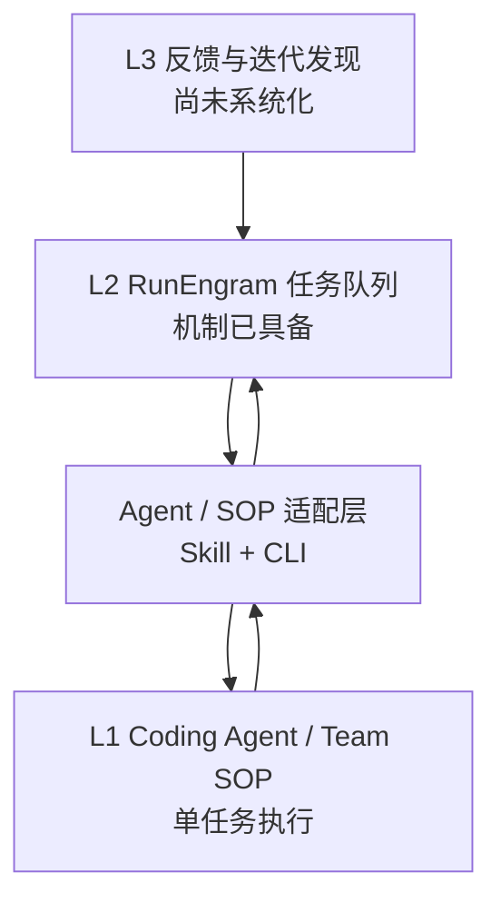

# Taskline 三层 Agent Loop 架构

## 结论

当前方案采用 L1-L2-L3 分层，但还不是完整闭环。

| 层级 | 文章定义 | 当前实现 | 判断 |
| --- | --- | --- | --- |
| L1 Agent Loop | 一个 Agent 完成一个任务的完整生命周期 | 外部 Coding Agent 或团队现有 SOP 负责分析、开发、测试和评审 | 通过 Skill / CLI 接入 |
| L2 Task Loop | Agent 从队列领取任务，完成后继续领取，直到队列为空 | RunEngram 执行内核支持依赖、优先级、原子领取、租约、心跳、释放和历史 | 队列机制具备，连续 Runner 缺失 |
| L3 Iteration Loop | 从用户反馈和数据中发现问题，形成 Proposal，审批后进入任务队列，发布后验证 | 当前主要依赖人工发现和建任务 | 尚未闭环 |

## 当前系统



真正价值不是另一套看板，而是 RunEngram 与不同 AI Coding 工作流之间的
标准执行适配层，以及执行后形成的可验证学习。

## 两套状态的职责

目前存在两套状态：

1. RunEngram 全局任务状态：
   `pending → start → spec → dev → test → review → done`。
2. 外部 Agent 或 SOP 的本地会话状态：需求分析、技术方案、任务规划、
   编码、测试、代码评审。

不能让两套状态互相独立推进，否则会出现“RunEngram 显示开发中，本地流程
已结束”之类的分裂状态。

职责约束：

- RunEngram 是全局事实源：任务阶段、依赖、优先级、领取人、租约、历史；
- 外部 Agent / SOP 是单任务执行器：阶段内部步骤、检查点、恢复信息、
  本地产物；
- 适配器负责映射状态和交付物，不在两边重复实现业务规则；
- 状态冲突时，以 RunEngram 阶段为准，本地会话状态只用于恢复执行细节。

建议映射：

| RunEngram 状态 | Agent / SOP 工作内容 | 回写交付物 |
| --- | --- | --- |
| `spec` | 需求分析、范围、验收标准 | Spec |
| `dev` | 技术方案、任务拆分、编码实现 | Dev Notes |
| `test` | 快速检查、深度检查、测试用例、E2E | Test Report |
| `review` | Code Review、PR、CI | Review Report |
| `done` | 服务端证据门禁通过 | 完成记录 |

## 最小闭环

先完成一个真实项目任务，不直接做无人值守队列：

1. `runengram status` 做身份和服务预检；
2. `runengram task next --claim` 原子领取任务；
3. 适配器读取任务目标、验收标准、文档和依赖；
4. 调用当前 Agent 或团队 SOP 执行任务；
5. 每个阶段通过后，同步状态和 Markdown 交付物；
6. 长任务定时 heartbeat；
7. 人工阻塞时保留现场并 release，失败时不得标记完成；
8. 服务端门禁通过后进入 `done`。

此路径稳定后，再增加 L2 Runner：

```text
while runengram task next --claim:
    run L1
    sync result
    continue
```

Runner 必须区分：

- 队列为空：正常结束；
- 有任务但依赖未满足：阻塞结束；
- 任务需要人工决策：暂停并通知；
- 执行失败：保留证据，不自动跳过或标记完成。

## L3 演进

L1、L2 稳定后再做 L3。个人试点只接一到两个真实信号源，例如：

- APM 告警或体验指标；
- CI 失败；
- 用户反馈；
- Code Review 中反复出现的问题。

L3 输出 Proposal，不直接创建可执行任务。Proposal 至少包含背景、目标、
非目标、证据、验收指标、依赖和优先级。人工确认后才从 `pending` 进入
`start`。发布后重新读取指标和反馈，再决定关闭或产生后续任务。

## 演进顺序

1. L1：使用 `taskline-management` 适配器跑通单任务。
2. L2：增加连续领取、heartbeat、恢复和停止条件。
3. L3：增加反馈采集、Proposal 审批和发布后验证。

不需要重写外部 Coding Agent 或团队 SOP。保持适配层轻量，让任务事实、
执行细节和学习资产职责清晰。
