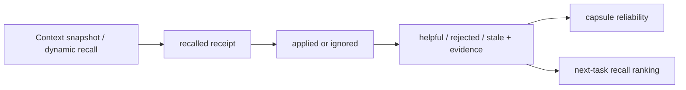

# Memory Impact Receipts Implementation Plan

> **For agentic workers:** REQUIRED SUB-SKILL: Use
> `superpowers:executing-plans` to implement this plan task-by-task. Keep each
> red/green cycle and commit boundary intact.

**Goal:** Make every recalled engineering memory observable from recall through
application and verified outcome, so RunEngram can show which experience changed
which task instead of reporting only capsule totals.

**Architecture:** Add a durable `memory_impacts` receipt ledger beside existing
`capsule_usages`. Context creation and dynamic recall automatically create
`recalled` receipts; agents and developers advance them to `applied`, `ignored`,
`helpful`, `rejected`, or `stale` with typed evidence. Existing usage rows remain
the confidence/reliability signal. Project metrics, capsule history, and task
Action Console read the new ledger. Old context snapshots are reconciled
idempotently before metrics/history reads, without inventing outcomes.

**Tech Stack:** Go 1.24, Hertz, SQLite via `modernc.org/sqlite`, Cobra, React 19,
TypeScript, TanStack Query, Vitest, Testing Library, Tailwind CSS.

---

## File structure

- Create `server/migrations/0022_memory_impacts.sql`: durable receipt table and
  indexes.
- Create `server/internal/store/schema/0022_memory_impacts.sql`: embedded mirror
  of migration.
- Modify `server/api/model/model.go`: receipt states, evidence, filters, update
  input, and metrics.
- Create `server/internal/store/memory_impact.go`: receipt persistence,
  reconciliation queries, completion finalization, and aggregate metrics.
- Create `server/internal/store/memory_impact_test.go`: store state, history,
  uniqueness, orphan-history, and aggregate tests.
- Create `server/internal/service/memory_impact.go`: transition validation,
  evidence rules, recall recording, reconciliation, and usage mirroring.
- Create `server/internal/service/memory_impact_test.go`: service policy tests.
- Modify `server/internal/service/learning.go`: automatically record initial and
  dynamic recalls; expose impact metrics; route existing usage feedback through
  receipts.
- Modify `server/internal/service/service.go`: best-effort unresolved-receipt
  finalization on task completion.
- Modify `server/internal/service/learning_test.go`: recall and legacy usage
  integration coverage.
- Modify `server/internal/service/service_test.go`: completion behavior coverage.
- Create `server/api/handler/memory_impact.go`: list and update HTTP handlers.
- Modify `server/api/handler/handler.go`: register receipt endpoints and extend
  usage request.
- Modify `server/tests/e2e_test.go`: HTTP learning-impact loop and historical
  reconciliation coverage.
- Modify `cli/client/client.go`: mirrored receipt types and evidence-aware usage
  payload.
- Modify `cli/cmd/capsule.go`: `capsule use` stage/evidence flags and validation.
- Modify `cli/cmd/capsule_test.go`: command contract coverage.
- Modify `web/src/lib/api.ts`: receipt types and list/update clients.
- Modify `web/src/lib/api.test.ts`: URL, query, and payload contract tests.
- Create `web/src/components/MemoryImpactFunnel.tsx`: recall/application/outcome
  funnel and definitions.
- Create `web/src/components/MemoryImpactFunnel.test.tsx`: metric and empty-state
  tests.
- Modify `web/src/components/MemoryMetrics.tsx`: separate learning effect from
  run reliability.
- Modify `web/src/components/KnowledgeView.tsx`: render impact funnel and load
  selected-capsule history.
- Modify `web/src/components/KnowledgeView.test.tsx`: knowledge page integration
  coverage.
- Create `web/src/components/MemoryImpactHistory.tsx`: capsule-to-task impact
  timeline.
- Create `web/src/components/MemoryImpactHistory.test.tsx`: state/evidence
  rendering tests.
- Modify `web/src/components/MemoryDetail.tsx`: mount history beneath capsule
  content.
- Create `web/src/components/TaskMemoryImpactPanel.tsx`: task impact list, quick
  resolution, and evidence form.
- Create `web/src/components/TaskMemoryImpactPanel.test.tsx`: user interaction
  and failed-save preservation tests.
- Modify `web/src/components/ActionConsole.tsx`: show impact receipts for focused
  task.
- Modify `web/src/components/ActionConsole.test.tsx`: task console integration.
- Modify `web/src/lib/i18n.tsx`: Simplified Chinese and English copy.
- Modify `skills/taskline-management/SKILL.md`: agent receipt contract.
- Modify `README.md`, `README.zh-CN.md`, and `ARCHITECTURE.md`: explain visible
  memory effect loop and screenshots/metrics semantics.
- Modify `plugins/runengram/.codex-plugin/plugin.json`: plugin version bump.
- Regenerate plugin skill copy with existing sync script.

### Task 1: Add durable memory-impact ledger

**Files:**
- Create: `server/migrations/0022_memory_impacts.sql`
- Create: `server/internal/store/schema/0022_memory_impacts.sql`
- Modify: `server/api/model/model.go`
- Create: `server/internal/store/memory_impact.go`
- Create: `server/internal/store/memory_impact_test.go`

- [ ] **Step 1: Write failing store tests**

Cover:

```go
func TestMemoryImpactRecallUpsertPreservesLaterState(t *testing.T)
func TestMemoryImpactListFiltersProjectTaskAndCapsule(t *testing.T)
func TestMemoryImpactOptimisticUpdateAndEvidenceRoundTrip(t *testing.T)
func TestMemoryImpactHistorySurvivesTaskDeletion(t *testing.T)
func TestMemoryImpactMetricsCountDistinctTasks(t *testing.T)
func TestMarkTaskMemoryImpactsUnconfirmedOnlyTouchesUnresolved(t *testing.T)
```

First test shape:

```go
impact, err := st.UpsertMemoryImpactRecall(ctx, &model.MemoryImpact{
    ProjectID: project.ID,
    TaskID: task.ID,
    CapsuleID: capsule.ID,
    State: model.MemoryImpactRecalled,
    RecallSource: "task-context",
    ContextRevision: "rev-1",
    RecallScore: 0.91,
    RecallReasons: []string{"label:android", "scope:camscanner"},
})
require.NoError(t, err)

applied, err := st.UpdateMemoryImpact(ctx, impact.ID, store.MemoryImpactUpdate{
    State: ptr(model.MemoryImpactApplied),
    Notes: ptr("Skipped Gradle because project rule forbids local builds."),
    ExpectedUpdatedAt: impact.UpdatedAt,
})
require.NoError(t, err)

again, err := st.UpsertMemoryImpactRecall(ctx, &model.MemoryImpact{
    ProjectID: project.ID,
    TaskID: task.ID,
    CapsuleID: capsule.ID,
    State: model.MemoryImpactRecalled,
    RecallSource: "dynamic-recall",
    ContextRevision: "rev-2",
    RecallScore: 0.97,
})
require.NoError(t, err)
require.Equal(t, model.MemoryImpactApplied, again.State)
require.Equal(t, applied.Notes, again.Notes)
require.Equal(t, "rev-2", again.ContextRevision)
```

- [ ] **Step 2: Run store tests and verify failure**

```bash
cd server && go test ./internal/store -run MemoryImpact
```

Expected: FAIL because models, migration, and store methods do not exist.

- [ ] **Step 3: Add schema in both migration trees**

Use identical SQL:

```sql
CREATE TABLE memory_impacts (
  id TEXT PRIMARY KEY,
  project_id TEXT NOT NULL REFERENCES projects(id) ON DELETE CASCADE,
  task_id TEXT NOT NULL,
  capsule_id TEXT NOT NULL,
  state TEXT NOT NULL CHECK (
    state IN ('recalled','applied','ignored','helpful','rejected','stale','unconfirmed')
  ),
  recall_source TEXT NOT NULL DEFAULT '',
  context_revision TEXT NOT NULL DEFAULT '',
  recall_score REAL NOT NULL DEFAULT 0,
  recall_reasons_json TEXT NOT NULL DEFAULT '[]',
  stage TEXT NOT NULL DEFAULT '',
  notes TEXT NOT NULL DEFAULT '',
  evidence_json TEXT NOT NULL DEFAULT '[]',
  actor TEXT NOT NULL DEFAULT '',
  created_at INTEGER NOT NULL,
  updated_at INTEGER NOT NULL,
  resolved_at INTEGER,
  UNIQUE(task_id, capsule_id)
);

CREATE INDEX idx_memory_impacts_project_updated
  ON memory_impacts(project_id, updated_at DESC);
CREATE INDEX idx_memory_impacts_task
  ON memory_impacts(task_id, updated_at DESC);
CREATE INDEX idx_memory_impacts_capsule
  ON memory_impacts(capsule_id, updated_at DESC);
```

Task and capsule columns intentionally have no foreign key. Receipt history must
survive task/capsule deletion; project deletion remains the explicit cleanup
boundary.

- [ ] **Step 4: Add domain types**

Add:

```go
type MemoryImpactState string

const (
    MemoryImpactRecalled    MemoryImpactState = "recalled"
    MemoryImpactApplied     MemoryImpactState = "applied"
    MemoryImpactIgnored     MemoryImpactState = "ignored"
    MemoryImpactHelpful     MemoryImpactState = "helpful"
    MemoryImpactRejected    MemoryImpactState = "rejected"
    MemoryImpactStale       MemoryImpactState = "stale"
    MemoryImpactUnconfirmed MemoryImpactState = "unconfirmed"
)

type MemoryImpactEvidence struct {
    Kind    string `json:"kind"`
    Ref     string `json:"ref"`
    Summary string `json:"summary"`
}

type MemoryImpact struct {
    ID              string                 `json:"id"`
    ProjectID       string                 `json:"project_id"`
    TaskID          string                 `json:"task_id"`
    CapsuleID       string                 `json:"capsule_id"`
    State           MemoryImpactState      `json:"state"`
    RecallSource    string                 `json:"recall_source"`
    ContextRevision string                 `json:"context_revision"`
    RecallScore     float64                `json:"recall_score"`
    RecallReasons   []string               `json:"recall_reasons"`
    Stage           string                 `json:"stage"`
    Notes           string                 `json:"notes"`
    Evidence        []MemoryImpactEvidence `json:"evidence"`
    Actor           string                 `json:"actor"`
    CreatedAt       int64                  `json:"created_at"`
    UpdatedAt       int64                  `json:"updated_at"`
    ResolvedAt      int64                  `json:"resolved_at,omitempty"`
}
```

Add `Valid`, `Terminal`, and `CanTransitionTo` methods. Final states are
`helpful`, `rejected`, and `stale`. Transition policy:

```text
recalled    -> applied|ignored|helpful|rejected|stale|unconfirmed
applied     -> helpful|rejected|stale
unconfirmed -> applied|ignored|helpful|rejected|stale
ignored     -> applied|helpful|rejected|stale
```

Final-to-final correction is service-authorized only when caller supplies
`expected_updated_at` and new evidence.

- [ ] **Step 5: Implement store operations**

Create:

```go
type MemoryImpactFilter struct {
    ProjectID string
    TaskID string
    CapsuleID string
    States []model.MemoryImpactState
    Limit int
}

type MemoryImpactUpdate struct {
    State *model.MemoryImpactState
    Stage *string
    Notes *string
    Evidence *[]model.MemoryImpactEvidence
    Actor *string
    ExpectedUpdatedAt int64
}
```

Implement:

```go
func (s *Store) UpsertMemoryImpactRecall(ctx context.Context, impact *model.MemoryImpact) (*model.MemoryImpact, error)
func (s *Store) GetMemoryImpact(ctx context.Context, id string) (*model.MemoryImpact, error)
func (s *Store) ListMemoryImpacts(ctx context.Context, filter MemoryImpactFilter) ([]model.MemoryImpact, error)
func (s *Store) UpdateMemoryImpact(ctx context.Context, id string, update MemoryImpactUpdate) (*model.MemoryImpact, error)
func (s *Store) MarkTaskMemoryImpactsUnconfirmed(ctx context.Context, taskID, actor string) error
func (s *Store) ListContextSnapshotsByProject(ctx context.Context, projectID string) ([]model.ContextSnapshot, error)
func (s *Store) GetMemoryImpactMetrics(ctx context.Context, projectID string) (*model.MemoryImpactMetrics, error)
```

`UpsertMemoryImpactRecall` updates only recall metadata on conflict. Never reset
state, notes, evidence, actor, `resolved_at`, or original `created_at`.

`UpdateMemoryImpact` uses:

```sql
... WHERE id=? AND updated_at=?
```

Return `store.ErrConflict` when zero rows change.

- [ ] **Step 6: Run store tests**

```bash
cd server && go test ./internal/store -run MemoryImpact
```

Expected: PASS.

- [ ] **Step 7: Commit**

```bash
git add server/migrations/0022_memory_impacts.sql \
  server/internal/store/schema/0022_memory_impacts.sql \
  server/api/model/model.go \
  server/internal/store/memory_impact.go \
  server/internal/store/memory_impact_test.go
git commit -m "feat(memory): persist recall impact receipts"
```

### Task 2: Record recalls and validate outcomes in service layer

**Files:**
- Create: `server/internal/service/memory_impact.go`
- Create: `server/internal/service/memory_impact_test.go`
- Modify: `server/internal/service/learning.go`
- Modify: `server/internal/service/learning_test.go`
- Modify: `server/internal/service/service.go`
- Modify: `server/internal/service/service_test.go`

- [ ] **Step 1: Write failing service tests**

Cover:

```go
func TestTaskContextCreatesRecallReceipts(t *testing.T)
func TestDynamicRecallUpsertsWithoutResettingAppliedReceipt(t *testing.T)
func TestRecordMemoryImpactRequiresNotesForApplied(t *testing.T)
func TestTerminalMemoryImpactRequiresTypedEvidence(t *testing.T)
func TestDeveloperCanCorrectTerminalImpactWithFreshEvidence(t *testing.T)
func TestAgentCannotOverwriteTerminalImpact(t *testing.T)
func TestRecordUsageMirrorsHelpfulReceiptAndCapsuleUsage(t *testing.T)
func TestDoneMarksUnresolvedImpactsUnconfirmedWithoutBlockingTask(t *testing.T)
func TestReconcileSnapshotsCreatesOnlyMissingRecallReceipts(t *testing.T)
```

Validation example:

```go
_, err := svc.RecordMemoryImpact(ctx, RecordMemoryImpactInput{
    ImpactID: impact.ID,
    State: model.MemoryImpactHelpful,
    Actor: "yue_zeng",
    Notes: "Avoided forbidden Gradle build and completed static verification.",
    Evidence: []model.MemoryImpactEvidence{{
        Kind: "task-doc",
        Ref: "doc:test-report",
        Summary: "Test report states no Gradle command was executed.",
    }},
    ExpectedUpdatedAt: impact.UpdatedAt,
})
require.NoError(t, err)
```

- [ ] **Step 2: Run tests and verify failure**

```bash
cd server && go test ./internal/service -run 'MemoryImpact|RecallReceipts|DoneMarks'
```

Expected: FAIL because receipt service does not exist.

- [ ] **Step 3: Implement service policy**

Create:

```go
type RecordMemoryImpactInput struct {
    ImpactID         string
    State            model.MemoryImpactState
    Stage            string
    Notes            string
    Evidence         []model.MemoryImpactEvidence
    Actor            string
    AgentName        string
    ExpectedUpdatedAt int64
}

func (s *Service) ListMemoryImpacts(ctx context.Context, filter store.MemoryImpactFilter) ([]model.MemoryImpact, error)
func (s *Service) RecordMemoryImpact(ctx context.Context, input RecordMemoryImpactInput) (*model.MemoryImpact, error)
func (s *Service) ReconcileMemoryImpacts(ctx context.Context, projectID string) error
```

Rules:

- `applied` and final outcomes require non-empty notes.
- final outcomes require at least one evidence item with supported kind and
  non-empty `ref` or `summary`;
- supported kinds: `command`, `task-doc`, `task-event`, `link`,
  `code-reference`, `observation`;
- agent identity may move non-final states only and cannot overwrite final state;
- developer/Web actor may correct final state only with matching
  `expected_updated_at` and fresh evidence;
- same state + same payload remains idempotent;
- `helpful`, `rejected`, and `stale` mirror existing `capsule_usages` exactly
  once through its `(capsule_id, task_id)` uniqueness;
- `stale` continues to mark capsule stale.

- [ ] **Step 4: Record automatic recall receipts**

Add helper:

```go
func (s *Service) recordRecallReceipts(
    ctx context.Context,
    task model.Task,
    recall model.MemoryRecall,
    source string,
) error
```

For each suggested capsule, write `recalled` with recall score/reasons from
`recall.Explanations`, context revision, and source.

Call after:

1. successful `CreateContextSnapshot` in `GetOrCreateTaskContext`;
2. `buildMemoryRecall` in `RecallTaskMemory`.

If an existing snapshot is returned, still call the helper. This repairs a
snapshot created before receipt support.

Dynamic-recall failure to write receipts must return an error; otherwise caller
would receive memory with no observable record. Existing task-context creation
must return the store error before promising a frozen context.

- [ ] **Step 5: Reconcile historical snapshots**

`ReconcileMemoryImpacts` lists project snapshots, rebuilds one receipt for each
`SuggestedCapsules` entry, and inserts only missing `(task_id, capsule_id)` rows.
Use source `snapshot-backfill`. Never infer `applied` or final outcomes from task
documents.

Call reconciliation before:

- project impact metrics;
- project/capsule impact history.

Task-specific reads need no full-project reconciliation; `GetOrCreateTaskContext`
repairs that task.

- [ ] **Step 6: Finalize unresolved receipts on task completion**

After a successful state change into `done`, call:

```go
_ = s.st.MarkTaskMemoryImpactsUnconfirmed(ctx, task.ID, "system")
```

Do not fail task completion if this best-effort write fails. Later list/metrics
reconciliation repairs missing recalls; unresolved finalization may be retried
by a subsequent done update or explicit history read.

- [ ] **Step 7: Run service tests**

```bash
cd server && go test ./internal/service
```

Expected: PASS.

- [ ] **Step 8: Commit**

```bash
git add server/internal/service/memory_impact.go \
  server/internal/service/memory_impact_test.go \
  server/internal/service/learning.go \
  server/internal/service/learning_test.go \
  server/internal/service/service.go \
  server/internal/service/service_test.go
git commit -m "feat(memory): track recall application outcomes"
```

### Task 3: Expose receipt API and CLI evidence

**Files:**
- Create: `server/api/handler/memory_impact.go`
- Modify: `server/api/handler/handler.go`
- Modify: `server/tests/e2e_test.go`
- Modify: `cli/client/client.go`
- Modify: `cli/cmd/capsule.go`
- Modify: `cli/cmd/capsule_test.go`

- [ ] **Step 1: Write failing HTTP end-to-end test**

Add `TestMemoryImpactReceiptLoopAtAPI`:

1. create project, verified capsule, task, and claim;
2. read task context;
3. assert `GET /tasks/:id/memory-impacts` returns `recalled`;
4. post `used` with stage/notes and assert `applied`;
5. post `helpful` with typed evidence and assert both receipt and existing
   capsule counters update;
6. read project metrics and assert recall coverage/application/confirmation;
7. delete task and assert capsule impact history still contains task ID.

Add `TestMemoryImpactBackfillsExistingSnapshotAtAPI` using a fixture snapshot
without receipt and assert metrics/history create only `recalled`.

- [ ] **Step 2: Run e2e tests and verify failure**

```bash
cd server && go test ./tests -run MemoryImpact
```

Expected: FAIL with missing routes.

- [ ] **Step 3: Register list routes**

```go
v1.GET("/projects/:project/memory-impacts", h.listProjectMemoryImpacts)
v1.GET("/tasks/:id/memory-impacts", h.listTaskMemoryImpacts)
v1.GET("/capsules/:id/memory-impacts", h.listCapsuleMemoryImpacts)
```

Query parameters:

- `state` repeatable or comma-separated;
- `limit`, default 100, max 500.

Responses are arrays of `model.MemoryImpact`.

- [ ] **Step 4: Extend existing usage endpoint**

Request:

```go
type recordCapsuleUsageReq struct {
    TaskID          string                       `json:"task_id"`
    Outcome         model.CapsuleOutcome         `json:"outcome"`
    Stage           string                       `json:"stage"`
    Notes           string                       `json:"notes"`
    Evidence        []model.MemoryImpactEvidence `json:"evidence"`
    Actor           string                       `json:"actor"`
    ExpectedUpdatedAt int64                      `json:"expected_updated_at"`
}
```

Mapping:

```text
used     -> applied
helpful  -> helpful
rejected -> rejected
stale    -> stale
```

Return `model.MemoryImpact` as canonical response. Existing clients tolerate
additional/different fields only after CLI and Web are updated in same release.

- [ ] **Step 5: Add CLI types and flags**

Add flags:

```go
capsuleUseCmd.Flags().String("stage", "", "task stage where memory affected work")
capsuleUseCmd.Flags().String("evidence-kind", "", "command|task-doc|task-event|link|code-reference|observation")
capsuleUseCmd.Flags().String("evidence-ref", "", "stable document, event, command, URL, or code reference")
capsuleUseCmd.Flags().String("evidence-summary", "", "observed result")
capsuleUseCmd.Flags().Int64("expected-updated-at", 0, "last observed impact updated_at when correcting an outcome")
```

Allow `--outcome ignored` as explicit non-use. Client maps it directly to a
new receipt update request rather than `CapsuleOutcome`, while legacy values use
the existing endpoint.

CLI preflight:

- `used`/`ignored`/final outcomes require `--notes`;
- final outcomes require `--evidence-kind` and either `--evidence-ref` or
  `--evidence-summary`;
- partial evidence flag sets fail before HTTP.

- [ ] **Step 6: Add CLI registration tests**

Assert all flags exist and help text lists:

```text
used|ignored|helpful|rejected|stale
```

Add pure validation table tests for required notes/evidence.

- [ ] **Step 7: Run backend and CLI tests**

```bash
cd server && go test ./...
cd ../cli && go test ./...
```

Expected: PASS.

- [ ] **Step 8: Commit**

```bash
git add server/api/handler/memory_impact.go \
  server/api/handler/handler.go \
  server/tests/e2e_test.go \
  cli/client/client.go \
  cli/cmd/capsule.go \
  cli/cmd/capsule_test.go
git commit -m "feat(api): expose memory impact receipts"
```

### Task 4: Replace invisible reuse count with impact funnel

**Files:**
- Modify: `server/api/model/model.go`
- Modify: `server/internal/store/memory_impact.go`
- Modify: `web/src/lib/api.ts`
- Modify: `web/src/lib/api.test.ts`
- Create: `web/src/components/MemoryImpactFunnel.tsx`
- Create: `web/src/components/MemoryImpactFunnel.test.tsx`
- Modify: `web/src/components/MemoryMetrics.tsx`
- Modify: `web/src/components/KnowledgeView.tsx`
- Modify: `web/src/components/KnowledgeView.test.tsx`
- Modify: `web/src/lib/i18n.tsx`

- [ ] **Step 1: Add failing aggregate tests**

Extend `LearningMetrics` with:

```go
RecalledTaskCount  int     `json:"recalled_task_count"`
RecalledMemoryCount int    `json:"recalled_memory_count"`
AppliedTaskCount   int     `json:"applied_task_count"`
HelpfulTaskCount   int     `json:"helpful_task_count"`
IgnoredCount       int     `json:"ignored_count"`
UnconfirmedCount   int     `json:"unconfirmed_count"`
RecallCoverageRate float64 `json:"recall_coverage_rate"`
ApplicationRate    float64 `json:"application_rate"`
ConfirmationRate   float64 `json:"confirmation_rate"`
```

Definitions:

```text
recall coverage = recalled distinct tasks / snapshot distinct tasks
application rate = distinct tasks with applied/final receipt / recalled distinct tasks
confirmation rate = distinct tasks with final receipt / distinct tasks with applied/final receipt
```

Guard every denominator. Rates are `0`, never NaN.

- [ ] **Step 2: Write failing Web tests**

`MemoryImpactFunnel.test.tsx`:

```ts
it("shows recall, application, and confirmed-helpful stages", () => {
  render(<MemoryImpactFunnel metrics={{
    recalled_task_count: 4,
    applied_task_count: 3,
    helpful_task_count: 2,
    ignored_count: 1,
    unconfirmed_count: 1,
    recall_coverage_rate: 1,
    application_rate: 0.75,
    confirmation_rate: 2 / 3,
  }} />);

  expect(screen.getByText("4 tasks recalled memory")).toBeTruthy();
  expect(screen.getByText("3 tasks applied memory")).toBeTruthy();
  expect(screen.getByText("2 tasks confirmed helpful")).toBeTruthy();
  expect(screen.getByText("1 awaiting confirmation")).toBeTruthy();
});
```

`KnowledgeView.test.tsx` must assert impact funnel and separate run reliability
section. Remove expectations that label `reused_task_count` as learning effect.

- [ ] **Step 3: Run focused Web tests and verify failure**

```bash
cd web && pnpm test -- MemoryImpactFunnel.test.tsx KnowledgeView.test.tsx api.test.ts
```

Expected: FAIL because metrics and component are missing.

- [ ] **Step 4: Implement metric query**

Use receipt table, not `capsule_usages`, for effect funnel. Keep existing
`HelpfulCount`, `RejectedCount`, `HelpfulRate`, run completion, and recovery
metrics as reliability data.

Set `ReusedTaskCount = AppliedTaskCount` temporarily for backward-compatible API
consumers, but stop presenting it as proof of improvement.

- [ ] **Step 5: Implement Web funnel**

Layout:

```text
Recall                    Applied                   Helpful
4 tasks / 100% coverage → 3 tasks / 75% applied → 2 tasks / 67% confirmed
                             ignored 1               unconfirmed 1
```

Each stage includes a one-line definition tooltip. No claim about saved hours.

`MemoryMetrics` becomes a compact reliability group:

- active verified memories;
- agent runs;
- run completion rate;
- recovery rate;
- stale memories.

- [ ] **Step 6: Run focused tests**

```bash
cd web && pnpm test -- MemoryImpactFunnel.test.tsx KnowledgeView.test.tsx api.test.ts
```

Expected: PASS.

- [ ] **Step 7: Commit**

```bash
git add server/api/model/model.go \
  server/internal/store/memory_impact.go \
  web/src/lib/api.ts \
  web/src/lib/api.test.ts \
  web/src/components/MemoryImpactFunnel.tsx \
  web/src/components/MemoryImpactFunnel.test.tsx \
  web/src/components/MemoryMetrics.tsx \
  web/src/components/KnowledgeView.tsx \
  web/src/components/KnowledgeView.test.tsx \
  web/src/lib/i18n.tsx
git commit -m "feat(web): show memory impact funnel"
```

### Task 5: Show capsule-to-task impact history

**Files:**
- Modify: `web/src/lib/api.ts`
- Modify: `web/src/lib/api.test.ts`
- Create: `web/src/components/MemoryImpactHistory.tsx`
- Create: `web/src/components/MemoryImpactHistory.test.tsx`
- Modify: `web/src/components/MemoryDetail.tsx`
- Modify: `web/src/components/KnowledgeView.tsx`
- Modify: `web/src/components/KnowledgeView.test.tsx`
- Modify: `web/src/lib/i18n.tsx`

- [ ] **Step 1: Write failing API and component tests**

API:

```ts
await listCapsuleMemoryImpacts("capsule/1");
expect(fetch).toHaveBeenCalledWith(
  "/api/v1/capsules/capsule%2F1/memory-impacts?limit=100",
  expect.objectContaining({ method: "GET" })
);
```

History component:

- shows task ID, stage, recall reason, current state, actor, and timestamp;
- shows typed evidence links/references;
- explains `unconfirmed` means memory was recalled but no result was recorded;
- preserves history even when task no longer resolves.

- [ ] **Step 2: Run tests and verify failure**

```bash
cd web && pnpm test -- MemoryImpactHistory.test.tsx KnowledgeView.test.tsx api.test.ts
```

Expected: FAIL.

- [ ] **Step 3: Implement history loading**

`KnowledgeView` query:

```ts
const impacts = useQuery({
  queryKey: ["memory-impacts", "capsule", selected?.id],
  queryFn: () => listCapsuleMemoryImpacts(selected!.id),
  enabled: Boolean(selected),
});
```

Pass data/loading/error/refetch into `MemoryDetail`; render
`MemoryImpactHistory` beneath relation/evidence sections.

- [ ] **Step 4: Run tests**

```bash
cd web && pnpm test -- MemoryImpactHistory.test.tsx KnowledgeView.test.tsx api.test.ts
```

Expected: PASS.

- [ ] **Step 5: Commit**

```bash
git add web/src/lib/api.ts \
  web/src/lib/api.test.ts \
  web/src/components/MemoryImpactHistory.tsx \
  web/src/components/MemoryImpactHistory.test.tsx \
  web/src/components/MemoryDetail.tsx \
  web/src/components/KnowledgeView.tsx \
  web/src/components/KnowledgeView.test.tsx \
  web/src/lib/i18n.tsx
git commit -m "feat(web): trace memory impact by task"
```

### Task 6: Add task-level impact confirmation to Action Console

**Files:**
- Create: `web/src/components/TaskMemoryImpactPanel.tsx`
- Create: `web/src/components/TaskMemoryImpactPanel.test.tsx`
- Modify: `web/src/components/ActionConsole.tsx`
- Modify: `web/src/components/ActionConsole.test.tsx`
- Modify: `web/src/lib/api.ts`
- Modify: `web/src/lib/api.test.ts`
- Modify: `web/src/lib/i18n.tsx`

- [ ] **Step 1: Write failing interaction tests**

Cover:

```ts
it("shows why each memory was recalled and whether task applied it")
it("records applied with stage and notes")
it("requires evidence before confirming helpful")
it("allows ignored with reason")
it("preserves draft and shows error when save fails")
it("shows unconfirmed receipts after task completion")
```

Helpful flow:

```ts
await user.click(screen.getByRole("button", { name: "Confirm helpful" }));
await user.selectOptions(screen.getByLabelText("Evidence type"), "task-doc");
await user.type(screen.getByLabelText("Evidence reference"), "doc:test-report");
await user.type(
  screen.getByLabelText("Observed result"),
  "Test report confirms no Gradle command was executed."
);
await user.click(screen.getByRole("button", { name: "Save result" }));

expect(updateMemoryImpact).toHaveBeenCalledWith(
  impact.id,
  expect.objectContaining({
    state: "helpful",
    expected_updated_at: impact.updated_at,
  })
);
```

- [ ] **Step 2: Run tests and verify failure**

```bash
cd web && pnpm test -- TaskMemoryImpactPanel.test.tsx ActionConsole.test.tsx
```

Expected: FAIL.

- [ ] **Step 3: Add task impact API client**

```ts
export async function listTaskMemoryImpacts(taskId: string): Promise<MemoryImpact[]>
export async function updateMemoryImpact(
  impactId: string,
  input: UpdateMemoryImpactInput
): Promise<MemoryImpact>
```

Register server route:

```go
v1.PATCH("/memory-impacts/:id", h.updateMemoryImpact)
```

Use actor `"web"`; server treats Web as developer input, not an agent identity.

- [ ] **Step 4: Implement task panel**

Panel order:

1. recalled capsule title/summary;
2. “why recalled” score and reasons;
3. current impact state;
4. actions `Applied`, `Ignored`, `Helpful`, `Incorrect`, `Stale`;
5. stage, notes, and typed evidence form;
6. conflict message with refresh action.

Do not require evidence for `applied` or `ignored`; require notes. Require typed
evidence for final outcomes.

- [ ] **Step 5: Mount in Action Console**

Load impacts for `focus.task.id`. Show:

```text
Memory affected this task
3 recalled · 2 applied · 1 confirmed helpful
```

Keep existing immutable resume snapshot card. Impact panel answers a different
question: what happened after recall.

- [ ] **Step 6: Run tests**

```bash
cd web && pnpm test -- TaskMemoryImpactPanel.test.tsx ActionConsole.test.tsx api.test.ts
```

Expected: PASS.

- [ ] **Step 7: Commit**

```bash
git add server/api/handler/memory_impact.go \
  server/api/handler/handler.go \
  web/src/components/TaskMemoryImpactPanel.tsx \
  web/src/components/TaskMemoryImpactPanel.test.tsx \
  web/src/components/ActionConsole.tsx \
  web/src/components/ActionConsole.test.tsx \
  web/src/lib/api.ts \
  web/src/lib/api.test.ts \
  web/src/lib/i18n.tsx
git commit -m "feat(web): confirm memory impact from tasks"
```

### Task 7: Update agent contract, docs, and plugin

**Files:**
- Modify: `skills/taskline-management/SKILL.md`
- Modify: `README.md`
- Modify: `README.zh-CN.md`
- Modify: `ARCHITECTURE.md`
- Modify: `plugins/runengram/.codex-plugin/plugin.json`
- Regenerate: plugin skill mirror selected by repository script

- [ ] **Step 1: Write failing skill smoke assertions**

Extend `scripts/test-skill.sh` expectations for:

```text
capsule use
--stage
--evidence-kind
--evidence-ref
--evidence-summary
used
ignored
helpful
rejected
stale
```

Require instruction sequence:

1. read task context immediately after claim;
2. record `used` when memory changes a decision/action;
3. record `ignored` when considered but not applicable;
4. record final outcome with evidence after verification;
5. never mark helpful from recall alone.

- [ ] **Step 2: Run smoke test and verify failure**

```bash
./scripts/test-skill.sh
```

Expected: FAIL because new contract text/flags are absent.

- [ ] **Step 3: Update canonical skill**

Add exact examples:

```bash
runengram capsule use "$CAPSULE_ID" \
  --task "$TASK_ID" \
  --outcome used \
  --stage dev \
  --notes "Applied project rule: skipped Gradle and used static inspection."

runengram capsule use "$CAPSULE_ID" \
  --task "$TASK_ID" \
  --outcome helpful \
  --stage test \
  --notes "Rule prevented unsupported local build and task verification completed." \
  --evidence-kind task-doc \
  --evidence-ref "doc:test-report" \
  --evidence-summary "Test report confirms no Gradle command was executed."
```

State that receipt recording is part of task execution, not optional analytics.

- [ ] **Step 4: Update public docs**

README sections:

- “See learning happen”: screenshot and three-stage impact funnel;
- “What counts as improvement”: recall, application, verified outcome;
- “What RunEngram does not claim”: no fake time-saving estimate;
- CLI examples for Codex and Claude Code;
- migration note: old snapshots backfill only `recalled`.

Architecture:



- [ ] **Step 5: Sync plugin and bump version**

Use repository sync/package script, not manual duplicate edits. Bump plugin
minor version to `0.8.0+codex.<build timestamp>`.

- [ ] **Step 6: Run docs/skill validation**

```bash
./scripts/test-skill.sh
rg -n "taskline-server|taskline[^-]" README.md README.zh-CN.md ARCHITECTURE.md skills plugins
```

Expected: skill test PASS; remaining `taskline` matches only intentional
compatibility notes or skill command name until separate rename migration.

- [ ] **Step 7: Commit**

```bash
git add skills/taskline-management/SKILL.md \
  README.md README.zh-CN.md ARCHITECTURE.md \
  plugins/runengram/.codex-plugin/plugin.json \
  plugins/runengram
git commit -m "docs: explain visible memory impact loop"
```

### Task 8: Full validation, real UI smoke, merge, publish, restart

**Files:**
- Verify all changed files
- Update screenshots only if UI has materially changed:
  `docs/assets/`

- [ ] **Step 1: Run formatters**

```bash
gofmt -w server/api/model/model.go \
  server/internal/store/memory_impact.go \
  server/internal/store/memory_impact_test.go \
  server/internal/service/memory_impact.go \
  server/internal/service/memory_impact_test.go \
  server/api/handler/memory_impact.go \
  cli/client/client.go \
  cli/cmd/capsule.go
```

- [ ] **Step 2: Run full automated suite**

```bash
( cd server && go test ./... )
( cd cli && go test ./... )
( cd web && pnpm lint && pnpm test && pnpm build )
./scripts/test-skill.sh
./scripts/build.sh
```

Expected: all PASS; `dist/runengram-server` and `dist/runengram` exist.

- [ ] **Step 3: Start isolated smoke environment**

```bash
SMOKE_DIR="$(mktemp -d)"
TASKLINE_LISTEN=127.0.0.1:18789 \
TASKLINE_DB_PATH="$SMOKE_DIR/runengram.db" \
TASKLINE_DOCS_DIR="$SMOKE_DIR/docs" \
./dist/runengram-server
```

Use a second terminal for API fixture setup. Do not touch user’s normal
`127.0.0.1:8787` database during smoke testing.

- [ ] **Step 4: Browser smoke test**

Verify Dracula default theme:

1. create project, capsule, task, and claim;
2. open task context so receipt becomes `recalled`;
3. Action Console shows recalled memory and reason;
4. mark applied, then helpful with evidence;
5. Knowledge page funnel changes immediately;
6. capsule detail shows task history and evidence;
7. refresh browser; all receipt states persist;
8. switch light/dark theme; both remain readable;
9. narrow viewport; panels scroll without hiding actions.

Capture updated Dracula screenshots into `docs/assets/` only after successful
smoke.

- [ ] **Step 5: Inspect git diff and commit screenshot/docs delta**

```bash
git status --short
git diff --check
git diff --stat
```

If screenshots changed:

```bash
git add docs/assets README.md README.zh-CN.md
git commit -m "docs: refresh memory impact screenshots"
```

- [ ] **Step 6: Merge and push**

From main checkout:

```bash
git switch main
git merge --ff-only codex/memory-impact-receipts
git push origin main
```

- [ ] **Step 7: Restart local service**

```bash
./scripts/start-local.sh
curl --fail http://127.0.0.1:8787/healthz
```

Verify PID/log files point at rebuilt `runengram-server`, not retired
`taskline-server`.

- [ ] **Step 8: Refresh local Codex plugin**

```bash
codex plugin marketplace upgrade runengram
codex plugin add runengram@runengram
```

Confirm installed plugin version matches manifest and
`taskline-management` skill help includes impact evidence flags.

