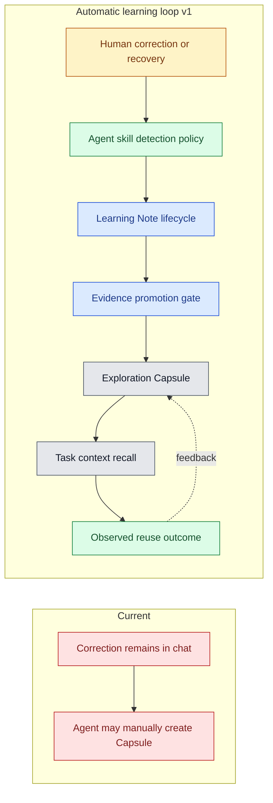

# Automatic Learning Loop v1

**Date:** 2026-07-28  
**Status:** Approved direction, implementation pending  
**Source task:** `b37572de-aa10-4e59-8da1-c1b5bc8dd223`

## Goal

RunEngram should make later coding-agent runs more accurate than earlier runs.
Version 1 closes one high-value loop:

```text
agent gets stuck
→ developer supplies a durable correction
→ agent captures a learning candidate
→ successful verification supplies evidence
→ RunEngram promotes verified knowledge
→ later tasks recall it
→ agents report whether it helped
```

Example: an agent cannot read a Notion requirement. The developer explains
that the existing `one-flow/notion-to-prd` capability should handle the link.
RunEngram records that correction, waits for successful use, promotes the
verified procedure, and recalls it when another task contains a Notion PRD.

## Product boundary

### In scope

- Capture durable human corrections and agent recovery discoveries during a
  claimed task.
- Keep captured content in a visible candidate state until evidence verifies
  it.
- Promote a verified candidate atomically into an active Exploration Capsule.
- Recall promoted capsules through the existing immutable task context.
- Record capture, promotion, rejection, recall, and reuse outcomes.
- Show candidate and promotion metrics in the bilingual Knowledge view.
- Make the agent protocol work with Codex, Claude Code, and other CLI-capable
  tools.

### Out of scope

- Reading hidden model reasoning.
- Uploading full chat transcripts.
- Running a background LLM service.
- Automatically changing source code, skills, tests, or team policies from one
  unverified statement.
- Vector databases, hosted services, Redis, or PostgreSQL.
- Causal claims about time saved.

## Use cases

1. A developer corrects a failed tool or workflow choice.
2. An agent discovers a command or code path after earlier attempts failed.
3. Verification proves the corrected procedure works.
4. Verification disproves the candidate, so the agent rejects it.
5. Work stops before verification; the candidate remains pending and visible.
6. A later task matches promoted knowledge and receives it in task context.
7. The later agent records `helpful`, `rejected`, or `stale`.
8. A different agent tool contributes to and consumes the same project memory.
9. Secrets, tokens, raw transcripts, and unsupported guesses never become
   active memory.

## Options considered

### A. Skill-only notes

The agent writes correction notes into task Markdown and manually creates a
capsule at the end.

- Small implementation.
- No new server model.
- Weak visibility, inconsistent capture, no candidate metrics, and poor
  recovery after interrupted runs.

### B. Candidate resource plus agent protocol

RunEngram stores a first-class Learning Note. Agent skills capture corrections
as they occur and verify or reject them after observing results. Verification
atomically creates an Exploration Capsule.

- Preserves evidence before memory.
- Survives agent restarts.
- Keeps automation tool-agnostic.
- Adds one focused persisted resource and a small CLI/API surface.

### C. Transcript ingestion and background LLM extraction

RunEngram receives complete conversations and continuously extracts rules.

- Captures more events without agent cooperation.
- Adds privacy risk, provider coupling, cost, nondeterminism, and a new runtime
  service.
- Conflicts with local-first design and evidence requirements.

## Decision

Implement option B.

The agent protocol performs semantic detection because the active coding agent
already sees the conversation. RunEngram stores state, enforces promotion
rules, and recalls verified knowledge. This boundary avoids transcript
collection and provider-specific integrations.

## Architecture

No new service or architectural layer is required. Extend the existing
`handler → service → store` path and the existing CLI/Web consumers.



### Roles

- **Detector:** agent-side policy that recognizes durable corrections and
  recoveries. It never sends a full transcript.
- **Learning Note:** persisted candidate with source, trigger, guidance, scope,
  labels, fingerprints, producer, and status.
- **Promotion Gate:** service rule that requires a live source task, a pending
  note, and non-empty verification evidence.
- **Exploration Capsule:** existing active memory model used by recall.
- **Outcome Recorder:** existing capsule-usage mechanism that measures observed
  value and staleness.

### Layering

- **Capability layer:** SQLite persistence, REST transport, CLI JSON output,
  task context snapshots.
- **Framework layer:** Learning Note state machine and atomic promotion.
- **Policy layer:** agent-side detection rules and project-specific labels,
  fingerprints, scope, and evidence.

New correction types or agent vendors should change policy data, not the
promotion framework.

## Learning Note model

```text
LearningNote
  id
  project_id
  source_task_id
  kind                 human_correction | agent_recovery
  trigger              what failed or required correction
  guidance             reusable action for a future agent
  scope                 where the guidance applies
  labels[]
  fingerprints[]
  producer              codex | claude-code | other
  status                pending | promoted | rejected
  evidence              verification evidence; empty while pending
  capsule_id            set after promotion
  rejection_reason      set after rejection
  created_at
  updated_at
  resolved_at
```

`source_task_id` belongs to the same project. Deleting a task must not erase its
learning history, so this field keeps no cascading foreign key. A promoted note
points to the capsule it created. The note remains immutable except for its
resolution fields.

## Public interfaces

### REST

```text
POST /api/v1/projects/:project/learning-notes
GET  /api/v1/projects/:project/learning-notes
GET  /api/v1/tasks/:id/learning-notes
POST /api/v1/learning-notes/:id/promote
POST /api/v1/learning-notes/:id/reject
```

Capture and resolution require an authenticated agent. Capture also requires
that the same agent own a live claim on the source task. Reads remain local and
unauthenticated, matching existing project knowledge reads.

Promotion creates the capsule and resolves the note in one store transaction.
Retries return the already-promoted result instead of creating duplicate
capsules.

### CLI

```bash
taskline learning capture <task-id> \
  --kind human-correction \
  --trigger "Notion requirement could not be read" \
  --guidance "Use one-flow/notion-to-prd for Notion requirement links" \
  --scope "Requirement analysis with Notion input" \
  --label notion --label prd \
  --fingerprint notion-to-prd \
  --producer codex

taskline learning list --project RunEngram --status pending

taskline learning promote <note-id> \
  --evidence-file ./verified-learning.md

taskline learning reject <note-id> \
  --reason "The project has no notion-to-prd capability"
```

Commands return JSON for agents and a compact table for humans. The CLI keeps
its independent HTTP types and does not import server packages.

### Agent skill

The public `taskline-management` skill adds three rules:

1. Capture a note without asking the user when the user corrects a failed
   reusable workflow choice, or when an agent recovery has value beyond the
   current task.
2. Do not capture task-only preferences, raw conversation, secrets, guesses,
   or information already supplied by recalled memory.
3. During test or wrap-up, promote candidates only when commands, tests,
   generated artifacts, or merged changes verify the guidance. Reject
   disproved candidates. Leave interrupted candidates pending.

This produces automatic behavior for every agent that follows the protocol.
The server does not need provider-specific chat access.

## Web experience

The existing Knowledge view gains:

- `Pending candidates`
- `Promoted from candidates`
- `Rejected candidates`
- `Promotion rate`

Candidate cards show kind, trigger, guidance, scope, producer, source task,
status, and resolution evidence. Active capsules remain the authoritative
recalled memory. Version 1 keeps candidate resolution in the authenticated CLI;
Web remains a transparent inspection surface.

## Error handling and safety

- Missing or expired source-task claim: `409`.
- Agent token missing or invalid: `401`.
- Source task and project mismatch: `409`.
- Empty trigger or guidance: `400`.
- Empty promotion evidence: `400`.
- Promoting a rejected note: `409`.
- Repeating promotion: return the existing promoted note and capsule.
- Repeating rejection: return the existing rejected note.
- Resolving one note concurrently: one transaction wins; later calls observe
  the resolved result.
- Input limits reject oversized trigger, guidance, scope, evidence, labels,
  and fingerprints before persistence.
- Skill rules prohibit secrets and raw transcripts. Product documentation
  states this boundary.

## Test seams

Tests exercise public behavior at these seams:

1. **Store seam:** migrations, CRUD, task attachment, and atomic idempotent
   promotion.
2. **Service seam:** claim ownership, project consistency, validation, and
   status transitions.
3. **HTTP seam:** authenticated capture and resolution plus stable JSON shapes.
4. **CLI seam:** command registration, required flags, identity use, JSON, and
   error propagation.
5. **Web seam:** Knowledge view renders candidate metrics and status groups.
6. **Skill seam:** smoke tests require correction capture, evidence promotion,
   rejection, and privacy rules.
7. **End-to-end seam:** capture the Notion example, promote it with evidence,
   start a related task, and confirm task context recalls the created capsule.

## Acceptance criteria

- An agent can capture a durable correction during a claimed task with one CLI
  command.
- A pending note survives server and agent restarts.
- Pending notes never appear in `suggested_capsules`.
- Promotion requires evidence and creates one active capsule.
- Repeated promotion creates no duplicate capsule.
- A later related task receives the promoted capsule in its immutable context.
- Reuse outcomes continue to update helpful, rejected, and stale metrics.
- Knowledge view displays pending, promoted, and rejected note counts in
  English and Simplified Chinese.
- Codex and Claude Code use the same commands and data model.
- README, PRODUCT, ARCHITECTURE, and public skill describe the complete loop.
- Existing task, capsule, CLI, Web, and migration tests remain green.

## Evolution

Version 1 establishes a deterministic capture and promotion protocol. Later
versions may add:

1. deduplication and repeated-observation confidence;
2. configurable team review before promotion;
3. promotion from capsules into skills, tests, lint rules, or workflow gates;
4. richer learning-lift metrics;
5. optional adapters that emit correction events from agent runtimes.

Each extension should reuse Learning Notes and promotion outcomes instead of
introducing a second memory path.
